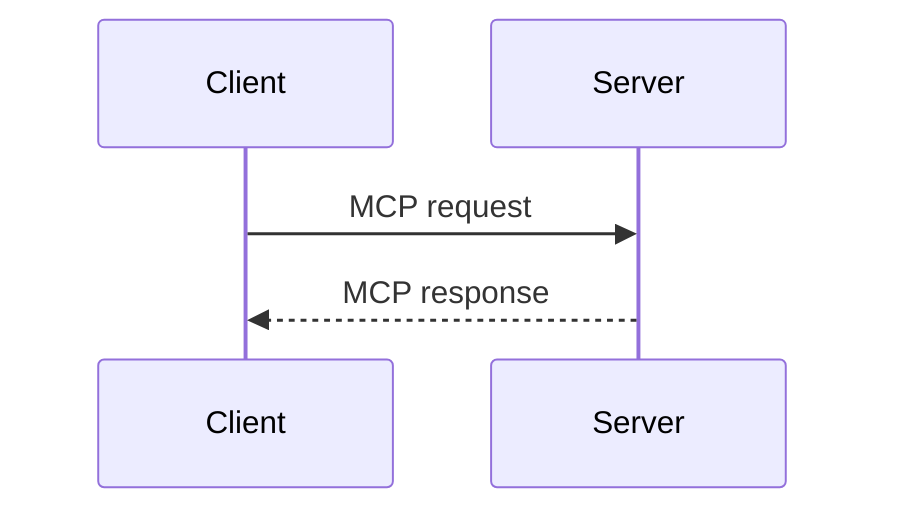
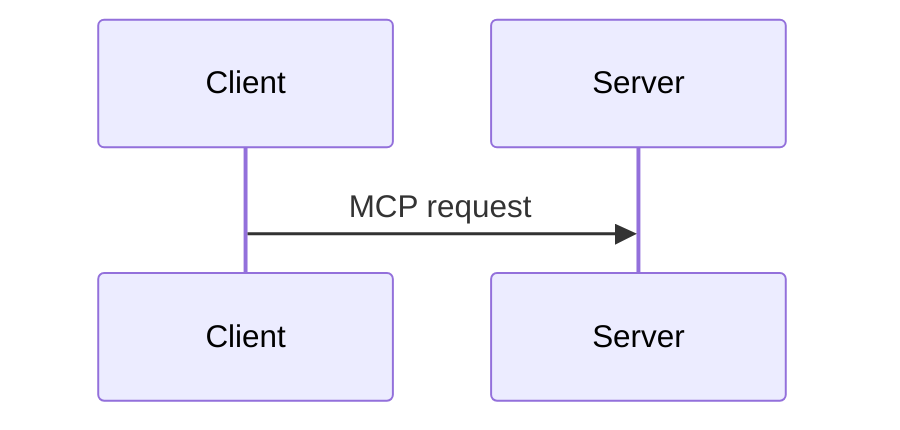

# Document components — documentación de alineación

Documentación funcional de la exploración de componentes documentales. Es una propuesta de producto: todavía no modifica el parser ni el editor de Odessay.

Abre [el playground](../../prototypes/document-components-playground.html), elige un elemento, edita su Markdown/MDX y revisa el resultado. Las notas se guardan localmente en el navegador.

## Idea central

- Markdown sigue siendo la base para texto y formato común.
- Los componentes enriquecidos usan etiquetas con apertura y cierre claros, estilo XML/JSX, y nombres `PascalCase`; no llevan prefijo `od-`.
- En edición se conserva el source. El preview muestra cómo lo leería alguien más.
- Los atributos visibles —por ejemplo, el título de una card— viven junto a la etiqueta; el contenido va entre las etiquetas.
- El código es literal. Mermaid sigue siendo un bloque de código fenced con lenguaje `mermaid`.
- Sólo los elementos que necesitan un dato adicional muestran `Configurar` —por ejemplo, el tipo de entidad o el lenguaje del código—; los componentes MDX se editan directamente en el source.

Esto es un perfil controlado inspirado en MDX, no la adopción de MDX completo. No se habilitan imports, JavaScript, expresiones ni componentes arbitrarios dentro del documento.

## Tres capas del documento

| Capa | Qué contiene | Regla |
| --- | --- | --- |
| Markdown puro | Párrafos, headings, bold, italic, strike, links, listas, citas, tablas, imágenes, footnotes y fences | Sigue siendo la base interoperable. |
| Componentes propios de Odessay | `Annotation`, `Highlight`, `ProtectedText` y `Entity` | Expresan semántica editorial que Markdown no tiene. |
| Componentes inspirados en MDX/Mintlify | `Tip`, `Info`, `Card`, `Accordion`, `Tabs`, `Steps`, `CodeGroup` y grupos | Se adopta sólo un vocabulario explícito y permitido. |

MDX no define por sí mismo una lista universal de componentes como `Card` o `Accordion`; define una forma de combinar Markdown con componentes. En Odessay esos nombres son componentes permitidos por nuestro perfil y todos pasan por la misma capa documental.

## Elementos

| Elemento | Forma | Datos principales | Activación |
| --- | --- | --- | --- |
| `Highlight` | Inline | `color` opcional; sin `id` en v1 | Bubble de selección |
| `Annotation` | Inline | `id`, `type`, `comment` | Bubble de selección |
| `ProtectedText` | Inline | `id` requerido, `reason` opcional | Bubble de selección |
| `Entity` | Inline | `id`, `type` | Bubble de selección |
| `Tip` / `Info` | Bloque | ninguno en la primera versión | `Insert` |
| `Card` / `CardGroup` | Bloque | `title`, `icon`, `href`, `columns` | `Insert` |
| `Accordion` / `AccordionGroup` | Bloque | `title`, `defaultOpen` | `Insert` |
| `Tabs` / `Tab` | Bloque | `title` | `Insert` |
| `Steps` / `Step` | Bloque | `title` | `Insert` |
| `CodeGroup` | Contenedor de fences | título/lenguaje del fence | `Code` / `Insert` |
| Mermaid | Fenced code | lenguaje `mermaid` | `Code` + configuración ligera |

## Cómo se usa

| Situación | Acción |
| --- | --- |
| Texto seleccionado | El bubble aplica `Highlight`, `Annotation`, `ProtectedText` o `Entity`. |
| Componente de bloque | `Insert` escribe la estructura y deja el cursor en el contenido. |
| Código o Mermaid | `Code` crea el fence; `Configurar` cambia el lenguaje o la vista cuando aplica. |
| Markdown nativo | Toolbar, shortcuts o sintaxis Markdown (`#`, `>`, `-`, `**`, `*`). |

La configuración adicional aparece sólo cuando hace falta. El título de una `Card` se edita en el propio componente y se serializa como `title="…"`; no requiere modal. Un popover pequeño basta para opciones cerradas como el tipo de `Entity`, el color del highlight o el lenguaje del código. En v1, desbloquear `ProtectedText` es un comando explícito y reversible, no un sistema de permisos ni un modal.

## Ejemplos

### Texto seleccionado

```md
<Highlight color="yellow">texto importante</Highlight>

<Annotation id="ann-123" type="personal" comment="Revisar esta idea.">texto anotado</Annotation>

<ProtectedText id="lock-123">Texto que no se debe eliminar.</ProtectedText>

<Entity id="ent-123" type="company">Aplyca</Entity>
```

`Annotation` reúne selección y comentario en una sola etiqueta. `Entity` conserva el texto visible y le agrega un tipo.

### Callout, Accordion y Card

```mdx
<Tip>Recuerda validar el cierre de cada etiqueta.</Tip>

<Info>Una información importante para entender este documento.</Info>

<Accordion title="New Accordion">
  Este contenido aparece al abrir el acordeón.
</Accordion>

<Card title="Build a Server" icon="server" href="/docs/build-server">
  Create MCP servers.
</Card>
```

Para convertir una selección en `Card`, la selección pasa a ser el contenido descriptivo y el componente se inserta con un título editable en la etiqueta de apertura:

```mdx
<Card title="Título de la card" icon="sparkles">
  Texto seleccionado convertido en descripción.
</Card>
```

El título se puede editar directamente en el componente; el resultado se serializa como `title="…"`. El texto descriptivo permanece dentro del componente.

`AccordionGroup` sólo agrupa varios `Accordion`; `defaultOpen="true"` controla cuál aparece abierto inicialmente.

### Tabs

```mdx
<Tabs>
  <Tab title="Tab 1">Contenido de la primera alternativa.</Tab>
  <Tab title="Tab 2">Contenido de la segunda alternativa.</Tab>
</Tabs>
```

Las pestañas sirven para alternativas; no deben esconder contenido que el lector necesita comparar al mismo tiempo.

### Grupos y pasos

```mdx
<CardGroup columns="2">
  <Card title="Build a Server">Create MCP servers.</Card>
  <Card title="Build a Client">Connect to MCP servers.</Card>
</CardGroup>

<Steps>
  <Step title="Discovery">El cliente descubre las capacidades.</Step>
  <Step title="Authorization">El cliente obtiene acceso.</Step>
</Steps>
```

El orden del source determina el orden de cards y pasos.

### Código

````mdx
<CodeGroup>
  ```json Request
  { "method": "server/discover" }
  ```

  ```json Response
  { "resultType": "complete" }
  ```
</CodeGroup>


````

El idioma y el título de pestaña se indican en el fence. El source del diagrama sigue siendo la referencia editable. Mermaid no necesita una etiqueta adicional:

````md

````

## Markdown que ya existe

No requiere componentes nuevos: párrafos, **bold**, *italic*, ~~strike~~, `inline code`, links, H1–H3, citas, listas, tablas, imágenes, bloques de código y footnotes.

```md
# Título
## Sección

Un párrafo con **negrita** y *cursiva*.

> Una cita.

- Una lista
- Otro elemento
```

## Decisiones cerradas y abiertas

- La nueva sintaxis `<Annotation>` reemplaza `==texto==[@n: comentario]`. La sintaxis anterior sólo se conserva como entrada de migración y nunca debe volver a producirse al guardar.
- Los cuatro componentes inline se modelan como marks; en v1 sólo aceptan selecciones dentro de un textblock.
- `Entity.id` identifica la entidad y puede repetirse en varias menciones. `Annotation.id` identifica una ocurrencia y se reminta al duplicar o pegar.
- `ProtectedText` evita edición accidental en Rich; no es una restricción de seguridad sobre source mode o editores externos.
- ¿Qué variantes debe admitir `Annotation.type`?
- ¿`Tip` e `Info` deben conservarse como dos etiquetas o exponerse como una sola familia configurable?

La enmienda D2/D3 del ADR, fechada el 2026-09-16, ya formaliza `<Annotation>` como sintaxis canónica. El parser de producción debe leer temporalmente ambas formas y escribir únicamente la nueva.

## Componentes revisados de Mintlify

MDX aporta la sintaxis para combinar Markdown con componentes; no obliga a adoptar una biblioteca completa. Para Odessay, el primer grupo queda limitado a patrones generales: callouts, acordeones y pestañas. `Card`, `CardGroup`, `Steps`, `CodeGroup` y Mermaid ya cubren los demás patrones generales que estamos explorando.

Se dejan para una fase posterior `Columns`/`Column`, `Expandable`, `Update`, `Tree`, `Frame`, `Prompt`, `ParamField`, `RequestExample`, `ResponseField` y `Color`. Los primeros son layout o presentación; los últimos están orientados a documentación de APIs, ejemplos ejecutables o árboles de archivos. `Expandable` además se solapa con `Accordion`.

Los fences con lenguaje, Mermaid y `$$` no son componentes MDX nuevos: son bloques o extensiones de Markdown. Por eso el lenguaje se configura en `Code`, mientras que Mermaid conserva su source como código literal.

Referencias: [MDX](https://mdxjs.com/docs/what-is-mdx/), [extensiones de MDX](https://mdxjs.com/docs/extending-mdx/), [componentes de Mintlify](https://www.mintlify.com/docs/components), [accordions](https://mintlify.com/docs/components/accordions) y [tabs](https://www.mintlify.com/docs/components/tabs).
