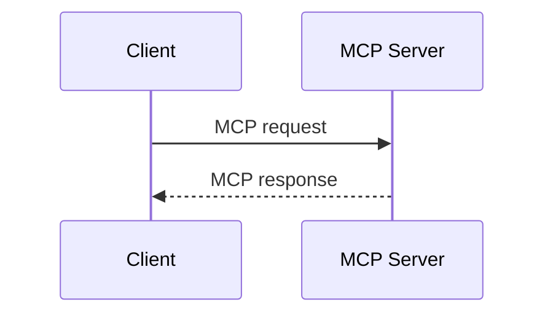

# Document Components Lab

> Exploración editable de la sintaxis y el comportamiento visual de los componentes documentales de Odessay.
>
> Estado: propuesta de diseño. Este documento no cambia todavía el parser, el serializer ni el contrato de producción.

## Cómo usar este laboratorio

Abre [el playground visual](../../prototypes/document-components-playground.html) en el navegador. La columna izquierda permite editar la sintaxis; `Invocation preview` muestra visualmente si el elemento se activa desde el toolbar, un dropdown, el selection bubble o un modal/popover; `Inline authoring preview` muestra la estructura que el editor inserta y dónde queda el cursor; el preview muestra el render propuesto y el inspector documenta los atributos y el flujo de inserción.

La fuente de verdad de esta exploración debe ser este documento más las decisiones que se vayan cerrando en el playground.

## Principios que estamos probando

- Las etiquetas tienen apertura y cierre inequívocos.
- No se agrega un prefijo `od-`.
- La sintaxis fuente debe seguir siendo legible aunque el usuario nunca la escriba a mano.
- El editor inserta nodos estructurados; no concatena texto para que después un regex intente reconstruirlos.
- Los bloques de código son opacos. Mermaid conserva el formato de bloque de código ` ```mermaid `.
- Los IDs se generan automáticamente y son estables durante los round-trips.
- `highlight` y `annotation` son entidades distintas.
- `annotation` fusiona la selección y su comentario; no necesita un `<note>` separado.
- `protected` y `entity` también son entidades distintas: una impone una restricción de edición y la otra agrega semántica a una selección.

## Componentes en exploración

| Componente | Forma | Propósito | Configuración inicial |
| --- | --- | --- | --- |
| `highlight` | Inline | Marcar texto sin comentario | color |
| `annotation` | Inline | Marcar texto y asociar un comentario | `id`, `type`, `comment` |
| `protected` | Inline | Mantener un texto visible pero fuera de la edición normal | `id`, `reason` opcional |
| `entity` | Inline | Clasificar una selección como una entidad semántica | `id`, `type` |
| `Tip` | Bloque | Mostrar una recomendación contextual | variante opcional |
| `Card` | Bloque | Mostrar un recurso enlazado | `title`, `icon`, `href` |
| `CardGroup` | Contenedor | Organizar cards en columnas | `columns` |
| `Steps` | Contenedor | Mostrar un flujo numerado | ninguno |
| `Step` | Bloque hijo | Representar un paso | `title` |
| `CodeGroup` | Contenedor | Agrupar bloques de código con pestañas | títulos de pestaña |
| Mermaid | Bloque de código | Renderizar un diagrama configurable | lenguaje `mermaid`, preview |

## Markdown nativo ya soportado

Estos primitives no necesitan etiquetas nuevas. Son la base Markdown que ya declara el perfil actual de Odessay: `heading-1`, `heading-2`, `heading-3`, `paragraph`, `blockquote`, `ordered-list`, `bullet-list`, `code-block`, `table`, `image`, `footnote`, además de las marcas `bold`, `italic`, `strike`, `highlight`, `link` e `inline-code`.

El playground los muestra en una sección separada para comparar lo que ya es Markdown puro con los componentes enriquecidos que estamos diseñando.

```md
# H1
## H2
### H3

Un párrafo con **bold**, *italic*, ~~strike~~, `inline code` y un [link](https://example.com).

> Una cita editorial.

- Una lista
- Otra lista

1. Un paso
2. Otro paso

```json
{ "resultType": "complete" }
```

| Primitive | Form |
| --- | --- |
| Bold | Inline |


Una frase con nota.[^1]

[^1]: Contenido de la nota.
```

`footnote` es la excepción de esta lista: es una extensión Markdown ya soportada por Odessay, no una etiqueta documental nueva.

## Sintaxis propuesta

### Highlight

```md
<highlight id="hl-123" color="yellow">
  texto simplemente resaltado
</highlight>
```

`id` puede ser opcional para un highlight puramente visual, aunque se recomienda conservarlo si existe la posibilidad de convertirlo después en una annotation.

### Annotation

```md
<annotation id="ann-123" type="personal" comment="Este comentario queda vinculado a la selección.">
  por ejemplo este texto es un solo mensaje
</annotation>
```

Reglas propuestas:

- El contenido de la etiqueta es la selección anotada.
- `comment` es opcional y reemplaza a un `<note>` separado.
- `type` puede empezar con `personal`, `ai` y `footnote`.
- El renderer puede mostrar el anchor como highlight y el comentario en el panel de márgenes.
- El comentario se edita desde un modal o panel; el usuario no necesita tocar el atributo.

### Protected text

```md
<protected id="lock-123" reason="System-managed">
  Este texto no se puede editar ni eliminar.
</protected>
```

`protected` es una restricción editorial, no una anotación. El texto permanece visible y forma parte del documento, pero el editor no permite modificarlo ni eliminarlo desde la interacción normal. La acción de desbloquear debe ser explícita y pertenecer a un flujo de permisos separado; no se debe esconder detrás de un simple click sobre el texto.

Reglas propuestas:

- Se crea únicamente a partir de una selección existente; no se inserta un nodo vacío.
- El editor muestra una affordance discreta de solo lectura y explica el motivo si existe `reason`.
- `id` es estable y lo genera el sistema; `reason` es opcional y no forma parte del cuerpo editorial.
- Si el usuario intenta escribir o borrar dentro del rango, el editor conserva la selección y ofrece el flujo de desbloqueo autorizado.

### Entity

```md
<entity id="ent-123" type="company">Aplyca</entity>
```

`entity` conserva el texto seleccionado como su forma visible y añade una clasificación semántica. En este ejemplo, `Aplyca` sigue siendo el texto que se lee, pero queda tipado como `company` (`Compañía`).

Reglas propuestas:

- Se crea seleccionando un rango y eligiendo `Entity` desde el selection bubble.
- Un modal pequeño permite elegir el tipo sin convertir esa decisión en texto del documento.
- `type` empieza con `company`, `person`, `place`, `product`, `event` y `custom`; las etiquetas visibles pueden localizarse (`Company / Compañía`).
- `id` identifica la mención de forma estable. La reutilización de una entidad entre varias menciones queda como una decisión posterior de catálogo.
- La entidad no debe cambiar el texto visible ni confundirse con `annotation`, cuyo propósito es guardar un comentario.

### Tip

```md
<Tip>
  Recuerda validar el cierre de cada etiqueta.
</Tip>
```

La variante podría expresarse como `<Tip type="warning">`, si realmente necesitamos más de un estilo. No se debe introducir `type` hasta que exista una diferencia visual o semántica clara.

### Cards y grupos de cards

```md
<CardGroup columns="2">
  <Card title="Build a Server" icon="server" href="/docs/build-server">
    Create MCP servers.
  </Card>

  <Card title="Build a Client" icon="computer" href="/docs/build-client">
    Connect to MCP servers.
  </Card>
</CardGroup>
```

El título y el body de `Card` se editan inline. Un popover o modal ligero queda reservado para icono, URL y otras propiedades del shell; `CardGroup` puede usar la misma superficie secundaria para columnas y orden.

### Steps

```md
<Steps>
  <Step title="Discovery">
    El cliente descubre las capacidades del servidor.
  </Step>

  <Step title="Authorization">
    El cliente obtiene un token válido.
  </Step>
</Steps>
```

El editor permite añadir, eliminar y reordenar pasos. El título se edita inline o desde un panel ligero.

### CodeGroup

```md
<CodeGroup>
  ```json Discover Request
  { "method": "server/discover" }
  ```

  ```json Discover Response
  { "resultType": "complete" }
  ```
</CodeGroup>
```

El contenido de cada pestaña sigue siendo un bloque de código normal. `CodeGroup` solo añade la navegación entre bloques y no reinterpreta su contenido.

### Mermaid

```md

```

Mermaid es un bloque de código configurable. El editor puede mostrar el código, el diagrama o ambos; el código sigue siendo la fuente canónica.

## Invocación en Artifact Studio

### Modelo de creación: contenido vs. propiedades

Para los componentes enriquecidos conviene separar dos capas:

1. **Contenido:** texto y Markdown que el usuario escribe dentro del componente. Se edita inline, con el mismo editor normal.
2. **Propiedades:** decisiones de presentación o estructura (`type`, `color`, `icon`, `href`, `columns`, orden). Se editan desde una configuración contextual y se serializan como atributos del nodo.

Eso permite que el usuario nunca tenga que escribir manualmente `<Card icon="server">` ni descubrir dónde cerrar una etiqueta. El editor manipula el nodo estructurado y el Markdown solo es la representación persistida.

### Dos maneras de crear un componente de bloque

| Flujo | Cuándo usarlo | Resultado |
| --- | --- | --- |
| `Insert → [componente]` | Cuando el usuario quiere empezar un bloque nuevo | Crea el nodo con defaults, coloca el cursor en su contenido y abre configuración solo si hacen falta varios datos |
| `Convert selection → [componente]` | Cuando ya existe contenido que debe adquirir ese formato | Envuelve uno o más **bloques completos**, conserva el texto seleccionado y prellena la configuración |

Un `Tip` o un `Card` son bloques. Por eso la conversión debe trabajar sobre párrafos/bloques completos, no sobre una selección arbitraria de media frase que produciría una estructura inválida. Si el usuario selecciona solo parte de un párrafo, el editor puede promover la operación al párrafo completo o deshabilitarla con una explicación clara.

### La estructura se inserta inline

La regla de interacción es que `Insert` crea la estructura y deja al usuario escribiendo dentro de ella. No se debe abrir un modal solo para pedir el texto que el editor puede recibir naturalmente como contenido:

```mdx
<Card title="Card title" icon="server" href="/docs/build-server">
  Escribe aquí la descripción del recurso.
</Card>
```

En Artifact Studio, el usuario no escribe esas etiquetas. El comando inserta el nodo estructurado, muestra sus campos editoriales y coloca el cursor en el campo correcto:

1. `Insert → Card` inserta el shell del Card y enfoca `title`.
2. El título y el body se escriben y formatean inline con TipTap.
3. `Properties` queda disponible para `icon`, `href`, `accent` y otras propiedades no editoriales.

La conversión desde una selección sigue el mismo patrón: `Select blocks → Card` conserva los bloques como body, inserta un título vacío y enfoca ese título. El body no se copia a un formulario ni se vuelve una cadena opaca.

El playground contiene `Inline authoring preview` para revisar tres cosas por componente: la estructura visible durante edición, la sintaxis que se persistiría y los pasos concretos de uso. Los campos marcados como `editable` representan contenido TipTap; los chips y el botón `Properties` representan metadata del nodo. En la maqueta, editar esos campos también actualiza el source y el preview para probar el recorrido completo.

### Ejemplo: Tip

- **Crear vacío:** `Insert → Tip` inserta `<Tip>`, pone el cursor dentro y permite escribir normalmente.
- **Convertir contenido:** seleccionar uno o más párrafos completos y elegir `Tip`; el contenido pasa a ser el cuerpo del bloque.
- **Editar después:** el cuerpo se modifica inline. Un botón de settings en el borde del bloque abre un popover o modal ligero para `variant`, color/acento y, si algún día existe, icono.

La primera versión puede tener un único estilo y no abrir configuración. La capacidad de cambiar el color no debe obligar a editar el texto ni a tocar el Markdown; debe ser una propiedad del nodo. Si más adelante aparecen variantes, `Properties` puede mostrar un popover o modal ligero sin sacar el body del documento.

### Ejemplo: Card y CardGroup

- **Crear un Card:** `Insert → Card` inserta la estructura inline y coloca el cursor en `title`. El título no se pide en un modal: es un campo editorial visible dentro del Card.
- **Convertir contenido:** seleccionar bloques completos y elegir `Card`; los bloques se convierten en el body editable y se crea un título vacío con foco. La selección no pasa por un formulario intermedio.
- **Agregar propiedades:** `Properties` edita `icon`, `href` y color/acento. Son metadata del shell y pueden vivir en un popover o modal ligero porque no son texto editorial.
- **Crear un grupo:** `Insert → Card group` inserta el contenedor y una primera Card. `Add card inline` agrega nuevas Cards; `columns` se puede ajustar desde las propiedades del grupo.
- **Editar después:** hacer click en la card deja el título y el body editables; `Properties` cambia la presentación sin sacar el contenido del documento.

En resumen: `Insert` crea la estructura; escribir modifica el contenido; `Configure` modifica la presentación. Esa misma regla se aplica a `CodeGroup`, Mermaid y los demás componentes.

El editor actual tiene superficies concretas de invocación. El playground las documenta para que podamos decidir los componentes nuevos sin inventar un slash menu que todavía no existe.

### Cómo leer `Invocation preview`

El panel visual responde al componente seleccionado en la columna izquierda:

- **Toolbar directo:** resalta `Bold`, `Italic`, `Strike` o `Inline code` cuando la acción es una marca inmediata.
- **Dropdown del toolbar:** abre `List`, `H1`/`Text`/`Code` o `Insert` y marca el comando que corresponde al elemento actual.
- **Selection bubble:** muestra `Highlight`, `AI`, `Footnote`, `Protect` y `Entity` sobre una selección simulada. `Protect` aplica una restricción; `Entity` continúa al siguiente paso de configuración.
- **Modal o popover:** `Preview modal` / `Preview settings` permite ver configuraciones que sí necesitan datos secundarios, como `Table`, `Link`, `Image`, `Entity` o lenguaje de código. En `Card`, la vista de propiedades es secundaria: el título y el body se muestran en `Inline authoring preview` y se editan inline.

Al hacer click en un item del toolbar o del bubble, el laboratorio cambia al componente correspondiente. Así se puede recorrer la decisión completa —superficie de invocación, configuración y representación Markdown— sin tener que imaginar qué significa cada fila de la tabla.

### Superficies actuales

- **Format toolbar:** botones directos para `Bold`, `Italic`, `Strike` e `Inline code`.
- **`Lists` dropdown:** `• List` y `# List`.
- **`Text` / `Code` dropdown:** `Normal`, `Heading 1`, `Heading 2`, `Heading 3`, `Blockquote` y `Code`; el trigger muestra `Code` cuando el cursor está dentro de un bloque de código.
- **`Insert` dropdown:** `Image`, `Table` y `Link`.
- **Selection popup:** `Highlight`, `AI` y `Footnote` cuando existe una selección.
- **Selection popup propuesto:** `Protect` aplica la restricción inmediatamente; `Entity` abre el modal de tipo y convierte la selección en una entidad.
- **Notes action:** acceso al panel de notas y al flujo de footnote.
- **Markdown shortcuts:** siguen siendo una segunda vía válida (`# `, `> `, `- `, `1. `, `**text**`, `*text*`, etc.). Los componentes enriquecidos pueden recibir un shortcut propio cuando su acción y semántica estén estables; no hay que asignarlo antes.

### Markdown nativo

| Elemento | Entrada actual | Overlay / configuración | Selección |
| --- | --- | --- | --- |
| Paragraph | Escribir directamente o `Text → Normal` · `⌘0` | Ninguno | Cursor en un bloque |
| Bold | `Format toolbar → Bold` · `⌘B` | Ninguno | Texto seleccionado o estado de escritura |
| Italic | `Format toolbar → Italic` · `⌘I` | Ninguno | Texto seleccionado o estado de escritura |
| H1 | `Text → Heading 1` · `⌘1` | Ninguno | Cursor en un bloque |
| H2 | `Text → Heading 2` · `⌘2` | Ninguno | Cursor en un bloque |
| H3 | `Text → Heading 3` · `⌘3` | Ninguno | Cursor en un bloque |
| Quote | `Text → Blockquote` · `⌘⇧B` | Directo en el código actual; atribución/modal pendiente | Cursor en un bloque |
| Bullet list | `Lists → • List` · `⌘L` | Ninguno | Cursor en un bloque |
| Numbered list | `Lists → # List` · `⌘⇧L` | Ninguno | Cursor en un bloque |
| Link | `Insert → Link` · `⌘⇧K` | Modal de formulario: texto + URL | Selección preferida |
| Inline code | `Format toolbar → Inline code` · `⌘E` | Ninguno | Texto seleccionado o estado de escritura |
| Strike | `Format toolbar → Strike` · `⌘⇧X` | Ninguno | Texto seleccionado o estado de escritura |
| Code block | `Text → Code` · `⌘⇧E` | Popover de settings: language/type; preview opcional | Cursor en un bloque |
| Table | `Insert → Table` · `⌘T` | Modal grid: filas + columnas; edición inline después | Cursor entre bloques |
| Image | `Insert → Image` · `⌘⇧I` | Modal de formulario: fuente + alt text | Cursor entre bloques |
| Footnote | Selection popup → `Footnote` o `Notes → Add note` · `⌘⇧A` / `⌘⇧N` | Modal de texto + panel `Notes`; numeración automática | Cursor o selección |
| Divider | `---` en una línea propia o comando `horizontalRule` · `⌘⇧-` | Ninguno; exposición en `Insert` pendiente | Cursor entre bloques |

### Componentes enriquecidos propuestos

Estos puntos de entrada todavía no existen en el toolbar actual. Son la propuesta que el playground permite validar:

| Elemento | Entrada propuesta | Shortcut | Overlay / configuración | Comportamiento |
| --- | --- | --- | --- | --- |
| `highlight` | Selection popup → `Highlight` | `⌘⇧H` actual | Ninguno en v1; color opcional en popover | Inserta inmediatamente sobre la selección |
| `annotation` | Selection popup → `AI` en el runtime actual; idealmente `Annotate` | No asignado; bubble primario | Composer flotante para `comment` + `type`, no modal de documento | Genera ID y conserva selección + comentario en un solo nodo |
| `protected` | Selection popup → `Protect` | No asignado; candidato | Ninguno; protección inmediata | Convierte la selección en texto de solo lectura; desbloquear es otro flujo |
| `entity` | Selection popup → `Entity` | No asignado; candidato | Modal pequeño: tipo de entidad | Conserva `Aplyca` como texto y agrega `type="company"` |
| `Tip` | `Insert → Tip` o convertir bloques completos | No asignado; candidato | Ninguno en v1; popover solo si aparecen variantes | Inserta bloque vacío o envuelve la selección de bloques |
| `Card` | `Insert → Card` o convertir bloques completos | No asignado; candidato | Inserción inline para título + body; `Properties` para `icon`/`href`/acento | El body y el título quedan editables dentro del nodo |
| `CardGroup` | `Insert → Card group` | No asignado; candidato | Contenedor inline; `Properties` para `columns` y metadata secundaria | Inserta contenedor, primera Card y control `Add card inline` |
| `Steps` / `Step` | `Insert → Steps` o convertir bloques consecutivos | No asignado; candidato | Controles inline; sin modal inicial | Inserta un primer step y permite agregar, eliminar y reordenar |
| `CodeGroup` | `Insert → Code group` | No asignado; candidato | Modal de setup: títulos de pestaña + lenguajes | Cada pestaña conserva un bloque de código opaco |
| Mermaid | `Text/Code → Code` → lenguaje `Mermaid` | Hereda `⌘⇧E` de Code block | Inspector/popover: lenguaje + code/diagram/split view | Continúa siendo un fenced code block; el código es canónico |

La regla de producto queda así: usar una acción directa cuando el resultado no necesita datos adicionales; usar un dropdown para elegir una variante estructural; insertar inline todo contenido editorial; y abrir un modal o popover solo cuando la inserción requiere propiedades secundarias o una decisión que no cabe de forma natural en línea.

Para las acciones sobre selección, el bubble funciona como una superficie de transformación: `Highlight` marca visualmente, `Protect` fija una restricción y `Entity` abre la configuración semántica. Un shortcut puede añadirse después de validar la frecuencia de uso; mientras no exista una combinación estable, el playground lo deja como candidato y no inventa un atajo que pueda colisionar con el editor.

### Bloque de código y lenguaje

Un bloque de código sigue siendo Markdown puro y opaco. Al crearlo con `Text → Code`, el trigger puede mostrar `Code` como en Artifact Studio. La configuración del bloque aparece asociada al propio bloque y permite elegir `text`, `json`, `javascript`, `typescript`, `python`, `bash` o `mermaid`.

El lenguaje se serializa en la información del fence (` ```json `, ` ```mermaid `); no se convierte en una etiqueta XML. Si el lenguaje es `mermaid`, el mismo bloque puede alternar entre código, diagrama o vista dividida.

### Context gap de Blockquote

`components/editor/editor-format-toolbar.tsx` ejecuta `toggleBlockquote()` directamente desde `Text → Blockquote`, mientras `workflow/context/features/odessay-editor.md` todavía describe un modal con texto y atribución. El playground registra el comportamiento actual como **sin modal** y deja la atribución como decisión abierta; clasificar esto como documentación desactualizada o como cambio de producto antes de implementarlo.

## Preguntas abiertas

- [ ] ¿`comment` debe vivir en el atributo o necesitamos otra representación para comentarios largos/rich text?
- [ ] ¿Quién puede desbloquear un `protected` y cómo se comunica el permiso sin hacer que el texto parezca un error?
- [ ] ¿Las entidades se reutilizan entre menciones mediante un catálogo o cada `<entity>` representa una mención independiente?
- [ ] ¿Qué atajos merecen asignarse a `Protect` y `Entity` después de validar frecuencia y colisiones?
- [ ] ¿El `id` de `highlight` es obligatorio o solo recomendado?
- [ ] ¿Qué valores iniciales tendrá `annotation.type`?
- [ ] ¿`Tip` necesita variantes o es siempre visualmente un tip?
- [ ] ¿`CardGroup` permite una, dos o tres columnas?
- [ ] ¿El usuario puede editar la sintaxis fuente directamente o solo desde el editor visual?
- [ ] ¿Mermaid guarda opciones de tema en el bloque o hereda el tema de Odessay?
- [ ] ¿Los nombres canónicos serán PascalCase (`<Card>`) o lowercase (`<card>`)?

## No resolver todavía

- No migrar aún la sintaxis actual `==texto==[@n|id: comentario]`.
- No cambiar todavía `lib/editor/annotation-markdown.ts` ni `lib/editor/footnote-extension.ts`.
- No añadir tags al perfil documental hasta cerrar esta exploración.
- No tratar el playground como implementación del parser: su renderer es únicamente demostrativo.
