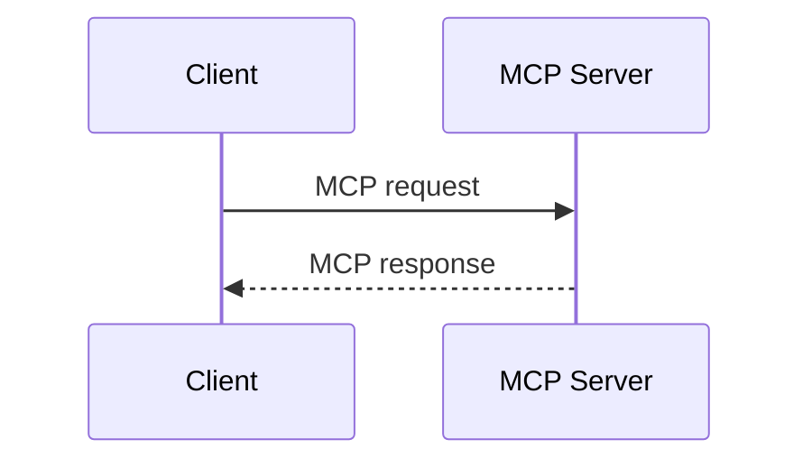

# Document Components Lab

> Exploración editable de la sintaxis y el comportamiento visual de los componentes documentales de Odessay.
>
> Estado: propuesta de diseño. Este documento no cambia todavía el parser, el serializer ni el contrato de producción.

## Cómo usar este laboratorio

Abre [el playground visual](../../prototypes/document-components-playground.html) en el navegador. La columna izquierda permite editar la sintaxis; el preview muestra el render propuesto y el inspector documenta los atributos y el flujo de inserción.

La fuente de verdad de esta exploración debe ser este documento más las decisiones que se vayan cerrando en el playground.

## Principios que estamos probando

- Las etiquetas tienen apertura y cierre inequívocos.
- No se agrega un prefijo `od-`.
- La sintaxis fuente debe seguir siendo legible aunque el usuario nunca la escriba a mano.
- El editor inserta nodos estructurados; no concatena texto para que después un regex intente reconstruirlos.
- Los bloques de código son opacos. Mermaid conserva el formato de bloque de código ` ```mermaid `.
- Los IDs se generan automáticamente y son estables durante los round-trips.
- `highlight` y `annotation` son entidades distintas.
- `annotation` fusiona la selección y su comentario; no necesita un `<note>` separado.

## Componentes en exploración

| Componente | Forma | Propósito | Configuración inicial |
| --- | --- | --- | --- |
| `highlight` | Inline | Marcar texto sin comentario | color |
| `annotation` | Inline | Marcar texto y asociar un comentario | `id`, `type`, `comment` |
| `Tip` | Bloque | Mostrar una recomendación contextual | variante opcional |
| `Card` | Bloque | Mostrar un recurso enlazado | `title`, `icon`, `href` |
| `CardGroup` | Contenedor | Organizar cards en columnas | `columns` |
| `Steps` | Contenedor | Mostrar un flujo numerado | ninguno |
| `Step` | Bloque hijo | Representar un paso | `title` |
| `CodeGroup` | Contenedor | Agrupar bloques de código con pestañas | títulos de pestaña |
| Mermaid | Bloque de código | Renderizar un diagrama configurable | lenguaje `mermaid`, preview |

## Markdown nativo ya soportado

Estos primitives no necesitan etiquetas nuevas. Son la base Markdown que ya declara el perfil actual de Odessay: `heading-1`, `heading-2`, `heading-3`, `paragraph`, `blockquote`, `ordered-list`, `bullet-list`, `code-block`, `table`, `image`, `footnote`, además de las marcas `bold`, `italic`, `strike`, `highlight`, `link` e `inline-code`.

El playground los muestra en una sección separada para comparar lo que ya es Markdown puro con los componentes enriquecidos que estamos diseñando.

```md
# H1
## H2
### H3

Un párrafo con **bold**, *italic*, ~~strike~~, `inline code` y un [link](https://example.com).

> Una cita editorial.

- Una lista
- Otra lista

1. Un paso
2. Otro paso

```json
{ "resultType": "complete" }
```

| Primitive | Form |
| --- | --- |
| Bold | Inline |


Una frase con nota.[^1]

[^1]: Contenido de la nota.
```

`footnote` es la excepción de esta lista: es una extensión Markdown ya soportada por Odessay, no una etiqueta documental nueva.

## Sintaxis propuesta

### Highlight

```md
<highlight id="hl-123" color="yellow">
  texto simplemente resaltado
</highlight>
```

`id` puede ser opcional para un highlight puramente visual, aunque se recomienda conservarlo si existe la posibilidad de convertirlo después en una annotation.

### Annotation

```md
<annotation id="ann-123" type="personal" comment="Este comentario queda vinculado a la selección.">
  por ejemplo este texto es un solo mensaje
</annotation>
```

Reglas propuestas:

- El contenido de la etiqueta es la selección anotada.
- `comment` es opcional y reemplaza a un `<note>` separado.
- `type` puede empezar con `personal`, `ai` y `footnote`.
- El renderer puede mostrar el anchor como highlight y el comentario en el panel de márgenes.
- El comentario se edita desde un modal o panel; el usuario no necesita tocar el atributo.

### Tip

```md
<Tip>
  Recuerda validar el cierre de cada etiqueta.
</Tip>
```

La variante podría expresarse como `<Tip type="warning">`, si realmente necesitamos más de un estilo. No se debe introducir `type` hasta que exista una diferencia visual o semántica clara.

### Cards y grupos de cards

```md
<CardGroup columns="2">
  <Card title="Build a Server" icon="server" href="/docs/build-server">
    Create MCP servers.
  </Card>

  <Card title="Build a Client" icon="computer" href="/docs/build-client">
    Connect to MCP servers.
  </Card>
</CardGroup>
```

El modal de `Card` configura título, icono, URL y contenido. El modal de `CardGroup` configura columnas y orden; las cards se pueden editar individualmente después.

### Steps

```md
<Steps>
  <Step title="Discovery">
    El cliente descubre las capacidades del servidor.
  </Step>

  <Step title="Authorization">
    El cliente obtiene un token válido.
  </Step>
</Steps>
```

El editor permite añadir, eliminar y reordenar pasos. El título se edita inline o desde un panel ligero.

### CodeGroup

```md
<CodeGroup>
  ```json Discover Request
  { "method": "server/discover" }
  ```

  ```json Discover Response
  { "resultType": "complete" }
  ```
</CodeGroup>
```

El contenido de cada pestaña sigue siendo un bloque de código normal. `CodeGroup` solo añade la navegación entre bloques y no reinterpreta su contenido.

### Mermaid

```md

```

Mermaid es un bloque de código configurable. El editor puede mostrar el código, el diagrama o ambos; el código sigue siendo la fuente canónica.

## Invocación en Artifact Studio

### Modelo de creación: contenido vs. propiedades

Para los componentes enriquecidos conviene separar dos capas:

1. **Contenido:** texto y Markdown que el usuario escribe dentro del componente. Se edita inline, con el mismo editor normal.
2. **Propiedades:** decisiones de presentación o estructura (`type`, `color`, `icon`, `href`, `columns`, orden). Se editan desde una configuración contextual y se serializan como atributos del nodo.

Eso permite que el usuario nunca tenga que escribir manualmente `<Card icon="server">` ni descubrir dónde cerrar una etiqueta. El editor manipula el nodo estructurado y el Markdown solo es la representación persistida.

### Dos maneras de crear un componente de bloque

| Flujo | Cuándo usarlo | Resultado |
| --- | --- | --- |
| `Insert → [componente]` | Cuando el usuario quiere empezar un bloque nuevo | Crea el nodo con defaults, coloca el cursor en su contenido y abre configuración solo si hacen falta varios datos |
| `Convert selection → [componente]` | Cuando ya existe contenido que debe adquirir ese formato | Envuelve uno o más **bloques completos**, conserva el texto seleccionado y prellena la configuración |

Un `Tip` o un `Card` son bloques. Por eso la conversión debe trabajar sobre párrafos/bloques completos, no sobre una selección arbitraria de media frase que produciría una estructura inválida. Si el usuario selecciona solo parte de un párrafo, el editor puede promover la operación al párrafo completo o deshabilitarla con una explicación clara.

### Ejemplo: Tip

- **Crear vacío:** `Insert → Tip` inserta `<Tip>`, pone el cursor dentro y permite escribir normalmente.
- **Convertir contenido:** seleccionar uno o más párrafos completos y elegir `Tip`; el contenido pasa a ser el cuerpo del bloque.
- **Editar después:** el cuerpo se modifica inline. Un botón de settings en el borde del bloque abre un popover o modal ligero para `variant`, color/acento y, si algún día existe, icono.

La primera versión puede tener un único estilo y no abrir configuración. La capacidad de cambiar el color no debe obligar a editar el texto ni a tocar el Markdown; debe ser una propiedad del nodo.

### Ejemplo: Card y CardGroup

- **Crear un Card:** `Insert → Card` abre un modal porque hay varios campos que no son cuerpo editorial: `title`, `icon`, `href` y, opcionalmente, color/acento. Al confirmar, el cuerpo queda listo para editar inline.
- **Convertir contenido:** seleccionar bloques completos y elegir `Card`; el modal aparece prellenado con el texto seleccionado como body.
- **Crear un grupo:** `Insert → Card group` abre primero la configuración de `columns` y crea la primera card. Las siguientes se agregan desde `Add card`; cada una puede abrir su propio modal de propiedades.
- **Editar después:** hacer click en la card deja el texto editable; `⋯` o `settings` abre la configuración de icono, URL, título y apariencia sin convertir esos datos en texto del cuerpo.

En resumen: `Insert` crea la estructura; escribir modifica el contenido; `Configure` modifica la presentación. Esa misma regla se aplica a `CodeGroup`, Mermaid y los demás componentes.

El editor actual tiene superficies concretas de invocación. El playground las documenta para que podamos decidir los componentes nuevos sin inventar un slash menu que todavía no existe.

### Superficies actuales

- **Format toolbar:** botones directos para `Bold`, `Italic`, `Strike` e `Inline code`.
- **`Lists` dropdown:** `• List` y `# List`.
- **`Text` dropdown:** `Normal`, `Heading 1`, `Heading 2`, `Heading 3`, `Blockquote` y `Code`.
- **`Insert` dropdown:** `Image`, `Table` y `Link`.
- **Selection popup:** `Highlight`, `AI` y `Footnote` cuando existe una selección.
- **Notes action:** acceso al panel de notas y al flujo de footnote.
- **Markdown shortcuts:** siguen siendo una segunda vía válida (`# `, `> `, `- `, `1. `, `**text**`, `*text*`, etc.).

### Markdown nativo

| Elemento | Entrada actual | Overlay / configuración | Selección |
| --- | --- | --- | --- |
| Paragraph | Escribir directamente o `Text → Normal` · `⌘⌥0` | Ninguno | Cursor en un bloque |
| Bold | `Format toolbar → Bold` · `⌘B` | Ninguno | Texto seleccionado o estado de escritura |
| Italic | `Format toolbar → Italic` · `⌘I` | Ninguno | Texto seleccionado o estado de escritura |
| H1 | `Text → Heading 1` · `⌘⌥1` | Ninguno | Cursor en un bloque |
| H2 | `Text → Heading 2` · `⌘⌥2` | Ninguno | Cursor en un bloque |
| H3 | `Text → Heading 3` · `⌘⌥3` | Ninguno | Cursor en un bloque |
| Quote | `Text → Blockquote` · `⌘⇧B` | Directo en el código actual; atribución/modal pendiente | Cursor en un bloque |
| Bullet list | `Lists → • List` · `⌘⇧8` | Ninguno | Cursor en un bloque |
| Numbered list | `Lists → # List` · `⌘⇧7` | Ninguno | Cursor en un bloque |
| Link | `Insert → Link` · `⌘K` | Modal de formulario: texto + URL | Selección preferida |
| Inline code | `Format toolbar → Inline code` · `⌘J` | Ninguno | Texto seleccionado o estado de escritura |
| Strike | `Format toolbar → Strike` · `⌥⌘U` | Ninguno | Texto seleccionado o estado de escritura |
| Code block | `Text → Code` · `⇧⌘J` | Ninguno actualmente; lenguaje es una extensión pendiente | Cursor en un bloque |
| Table | `Insert → Table` | Modal grid: filas + columnas; edición inline después | Cursor entre bloques |
| Image | `Insert → Image` | Modal de formulario: fuente + alt text | Cursor entre bloques |
| Footnote | `Notes → Add note` · `⌃⌘K` | Modal de texto + panel `Notes`; numeración automática | Cursor o selección |
| Divider | `---` en una línea propia o comando `horizontalRule` | Ninguno; exposición en `Insert` pendiente | Cursor entre bloques |

### Componentes enriquecidos propuestos

Estos puntos de entrada todavía no existen en el toolbar actual. Son la propuesta que el playground permite validar:

| Elemento | Entrada propuesta | Overlay / configuración | Comportamiento |
| --- | --- | --- | --- |
| `highlight` | Selection popup → `Highlight` | Ninguno en v1; color opcional en popover | Inserta inmediatamente sobre la selección |
| `annotation` | Selection popup → `AI` en el runtime actual; idealmente `Annotate` | Composer flotante para `comment` + `type`, no modal de documento | Genera ID y conserva selección + comentario en un solo nodo |
| `Tip` | `Insert → Tip` | Ninguno en v1; popover solo si aparecen variantes | Inserta bloque vacío y pone el cursor dentro |
| `Card` | Desde `Insert → Card group` o acción `Add card` | Modal de formulario: `title`, `icon`, `href`, contenido | Card editable individualmente |
| `CardGroup` | `Insert → Card group` | Modal de grupo: `columns` + orden; después modales de Card | Inserta contenedor y permite agregar/reordenar cards |
| `Steps` / `Step` | `Insert → Steps` | Controles inline; sin modal inicial | Inserta un primer step y permite agregar, eliminar y reordenar |
| `CodeGroup` | `Insert → Code group` | Modal de setup: títulos de pestaña + lenguajes | Cada pestaña conserva un bloque de código opaco |
| Mermaid | `Text → Code` → lenguaje `Mermaid` | Inspector/popover del code block: lenguaje + code/diagram/split view | Continúa siendo un fenced code block; el código es canónico |

La regla de producto queda así: usar una acción directa cuando el resultado no necesita datos adicionales; usar un dropdown para elegir una variante estructural; y abrir un modal solo cuando la inserción requiere varios atributos o una decisión que no cabe de forma natural en línea.

### Context gap de Blockquote

`components/editor/editor-format-toolbar.tsx` ejecuta `toggleBlockquote()` directamente desde `Text → Blockquote`, mientras `workflow/context/features/odessay-editor.md` todavía describe un modal con texto y atribución. El playground registra el comportamiento actual como **sin modal** y deja la atribución como decisión abierta; clasificar esto como documentación desactualizada o como cambio de producto antes de implementarlo.

## Preguntas abiertas

- [ ] ¿`comment` debe vivir en el atributo o necesitamos otra representación para comentarios largos/rich text?
- [ ] ¿El `id` de `highlight` es obligatorio o solo recomendado?
- [ ] ¿Qué valores iniciales tendrá `annotation.type`?
- [ ] ¿`Tip` necesita variantes o es siempre visualmente un tip?
- [ ] ¿`CardGroup` permite una, dos o tres columnas?
- [ ] ¿El usuario puede editar la sintaxis fuente directamente o solo desde el editor visual?
- [ ] ¿Mermaid guarda opciones de tema en el bloque o hereda el tema de Odessay?
- [ ] ¿Los nombres canónicos serán PascalCase (`<Card>`) o lowercase (`<card>`)?

## No resolver todavía

- No migrar aún la sintaxis actual `==texto==[@n|id: comentario]`.
- No cambiar todavía `lib/editor/annotation-markdown.ts` ni `lib/editor/footnote-extension.ts`.
- No añadir tags al perfil documental hasta cerrar esta exploración.
- No tratar el playground como implementación del parser: su renderer es únicamente demostrativo.
