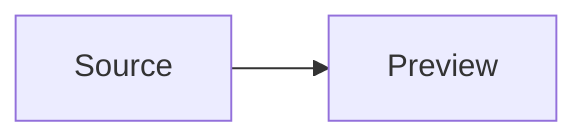

# Assets

<Card title="External reference" icon="image" href="https://example.com/safe">
The asset remains Markdown and keeps its alt text.
</Card>

```mermaid
flowchart LR
  Source --> Preview
```
