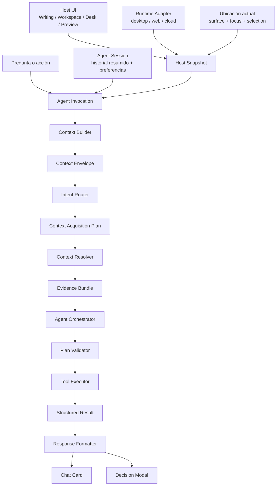

# ODESSAY — Arquitectura del Workspace Agent

**Documento de arquitectura objetivo para la plataforma de agentes.**

Lee primero `README.md` de este directorio. Para cualquier operación que toque identidad, filesystem, Workspace, apertura, guardado o sincronización, prevalecen `workflow/context/core/odessay-adr-identidad.md` y `workflow/context/features/odessay-desktop-document-catalog.md`.

## Tesis

Writing, Workspace, Desk y Preview no necesitan agentes distintos. Son superficies de invocación que construyen un contexto diferente para la misma capa de aplicación del agente.

```text
Writing / Workspace / Desk / Preview
              ↓
      Agent Invocation
              ↓
       Context Envelope
              ↓
      Agent Application
              ↓
     tools o workflows
```

El runtime define las capacidades efectivamente ejecutables. La ubicación define el foco y las referencias disponibles. Ninguna de las dos cosas debe ser inferida únicamente por el LLM.

## Arquitectura en una vista



## Capas y ownership

### Application — owner principal

La aplicación coordina el caso de uso completo:

- recibe `AgentInvocation`;
- construye el contexto semántico y operativo;
- clasifica la intención;
- genera y valida un plan;
- solicita evidencia bajo demanda;
- ejecuta tools o workflows;
- registra resultados y consumo;
- pide al LLM una respuesta final estructurada.

Aquí viven `ContextBuilder`, `ContextAcquisitionPlanner`, `ContextResolver`, `PlanValidator`, `WorkflowRunner` y `ContextLedger`.

### Domain — reglas estables

El dominio define reglas que no dependen de Tauri, Next o Supabase:

- identidad y versión del documento;
- significado de Workspace, `BindingRoot` y Writing;
- precondiciones de una propuesta;
- distinción entre lectura, generación y mutación;
- provenance de la evidencia.

### Adapters — infraestructura concreta

Los adapters implementan capacidades por runtime:

- desktop: `DocumentCatalog`, filesystem, `BindingRoot`, `DocumentService` y tools locales;
- web: AI remoto, documentos cloud y límites del browser;
- cloud: autenticación, inferencia remota y servicios compartidos.

El AI provider es un adapter. No es el owner de la política de contexto ni de la seguridad de las mutaciones.

### UI — presentación

La UI:

- crea la invocación desde la superficie actual;
- muestra `AgentResponse` en una Card;
- abre el detalle en un Modal;
- presenta evidencia, diff y precondiciones;
- ejecuta la aprobación explícita de una acción.

La UI no consulta SQLite, manifests, Supabase, Tauri ni rutas de filesystem para decidir identidad o contexto.

## Runtimes

| Runtime | Puede hacer | No debe asumir |
|---|---|---|
| Desktop | catálogo local, `BindingRoot`, lectura y mutación local autorizada | que toda carpeta visible es un Workspace o que una ruta es identidad |
| Web | conversación, generación y capacidades cloud disponibles | acceso al filesystem local o tools desktop |
| Cloud | inferencia, auth y servicios remotos | acceso directo al filesystem del usuario |

La implementación actual puede tener AI remoto tanto desde desktop como desde web. Eso no crea dos agentes: son adapters distintos detrás del mismo contrato de aplicación.

## Tools y workflows

Una **tool** es una operación atómica y validable:

- `read`
- `write`
- `edit`
- `move`
- `delete`

Un **workflow** es una secuencia controlada de tools con una intención de producto, por ejemplo:

```text
Broken Links
  → leer documentos
  → detectar referencias inválidas
  → construir propuestas
  → mostrar evidencia y diff
  → aprobar
  → ejecutar edit
```

El LLM puede seleccionar o proponer un tool/workflow, pero el `PlanValidator` comprueba schema, runtime, capabilities, precondiciones, límites y aprobación requerida antes de ejecutar.

## UI de respuesta

La respuesta del agente se produce una sola vez como contrato estructurado y tiene dos vistas:

- `Chat Card`: resumen, evidencia mínima y acciones principales.
- `Decision Modal`: evidencia completa, documentos afectados, precondiciones, diff, costo y acciones disponibles.

Abrir un documento citado es navegación/preview de la UI. No es una mutation tool.

## Invariantes

- El LLM decide semántica y redacción; nunca obtiene acceso directo al filesystem.
- Las tools ejecutan capacidades; un workflow solo las compone bajo una política validada.
- Toda mutación requiere aprobación explícita, precondiciones y evidencia.
- Un UUID nunca se trata como una ruta. El `DocumentCatalog` resuelve identidad antes de delegar al adapter filesystem.
- El `.md` materializado sigue siendo la fuente canónica; cache, evidencia, SQLite y Supabase son derivados o metadata según sus contratos.
- El Workspace Agent no crea un catálogo paralelo ni un write-path alternativo.
- Los documentos disponibles no se consideran consumidos hasta que el `ContextResolver` los incorpora a un `EvidenceBundle`.

## Estado actual frente al objetivo

El código actual ya tiene una capa de tools autorizadas, selección acotada, lectura de evidencia y respuestas de chat. Todavía no formaliza completamente:

- `AgentInvocation` y `ContextEnvelope` como contratos compartidos;
- selección lazy dependiente de la intención;
- registry común de tools/workflows;
- `AgentResponse` reutilizable entre Card y Modal;
- cache semántica y ledger de consumo.

La migración debe introducir esos contratos sin ampliar el camino legacy basado únicamente en `workspaceRootPath`.

## Clasificación arquitectónica

- **Layer dominante:** `Application`.
- **Layers secundarios:** `Domain`, `Adapter`, `UI`.
- **Runtime scope actual:** `desktop` para tools locales + `cloud` para inferencia; `web` con capacidades limitadas.
- **Runtime scope objetivo:** `shared-core` con adapters `desktop`, `web` y `cloud`.
- **Owner:** `architecture-first`.

