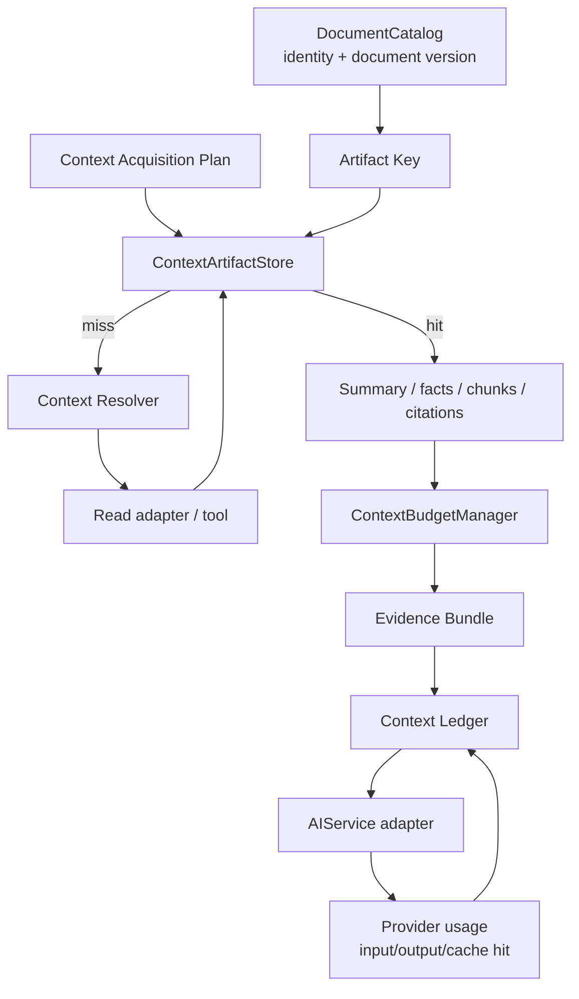

# ODESSAY — Cache, Presupuesto y Costo de Contexto

**Contrato objetivo para no recomputar ni pagar contexto innecesariamente.**

## Principio

Un documento ya revisado no debe volver a leerse o resumirse automáticamente en cada turno. Pero “revisado” no es un booleano: es un artifact derivado de una versión concreta, con cobertura y provenance.

```text
document UUID
  + content version/hash
  + representation
  + extraction policy
  = cache key
```

La cache nunca reemplaza al `.md` canónico ni se convierte en fuente de verdad.

## Componentes



## Artifacts versionados

```ts
type ContextArtifact = {
  documentId: string
  documentVersion: string
  representation: "metadata" | "summary" | "facts" | "chunks" | "full" | "instructions"
  content: unknown
  citations: Citation[]
  tokenCount: number
  createdAt: number
  extractionPolicy: string
}
```

Ejemplos:

- `metadata`: título, tipo, estatus, fecha y referencias básicas;
- `summary`: resumen compacto de una versión;
- `facts`: afirmaciones con citas;
- `chunks`: secciones relevantes;
- `full`: contenido completo de la fuente confirmada; si no cabe en una llamada, se procesa por etapas lossless o se devuelve `budget_exceeded`, nunca se recorta silenciosamente;
- `instructions` (ODE-504): la sección de instrucciones de operación de `workflow.md` que acompaña toda invocación del agente — el ledger contabiliza los tokens incorporados por esa sección, nunca los del documento completo.

Un resumen de la versión `A@v17` no es automáticamente válido para `A@v18`.

## Presupuesto

El `ContextBudgetManager` pertenece a `Application`. Calcula la capacidad física disponible y controla:

- tokens de entrada y salida;
- cantidad de documentos como dato de planificación, no como máximo de producto;
- bytes leídos;
- costo estimado;
- número de rondas de recuperación;
- prioridad de fuentes;
- representación máxima permitida.

```ts
type ContextBudget = {
  maxInputTokens: number
  maxOutputTokens: number
  maxDocuments: number // capacidad estimada de esta etapa, no límite de selección
  maxBytes: number
  maxRetrievalRounds: number
}
```

El LLM puede pedir rangos adicionales únicamente dentro de documentos ya seleccionados o confirmados; la solicitud pasa nuevamente por el planner y el presupuesto. Una fuente nueva requiere confirmación de la persona. El sistema no expande el Workspace por inferencia ni convierte `maxDocuments` en un límite arbitrario de cuatro o seis documentos.

## Ledger de consumo

```ts
type ContextLedgerEntry = {
  source: ContextReference
  documentVersion?: string
  representation: string
  tokens: number
  cacheHit: boolean
  reason: string
}
```

El ledger debe permitir responder:

- qué fuentes se consumieron;
- qué versión del documento se usó;
- qué se reutilizó de cache;
- cuántos tokens se enviaron;
- por qué se incorporó cada fuente;
- qué artifacts faltaron o quedaron fuera por presupuesto.

El `AIService` debe reportar el uso real del provider de forma abstracta:

```ts
type AIUsage = {
  inputTokens: number
  outputTokens: number
  cachedInputTokens?: number
  estimatedCost?: number
}
```

La cache local y cualquier cache del provider son capas distintas. La cache del provider puede reducir costo/latencia, pero no es una fuente de verdad ni debe ser el único mecanismo de reutilización.

## Invalidación

Invalidar o marcar stale cuando:

- cambia el hash o versión del `.md`;
- cambia la selección o sección solicitada;
- cambia la política de extracción;
- cambia el idioma o formato que afecta la representación;
- una mutación se confirma;
- el catálogo informa un cambio externo;
- se pierde la provenance de una cita.

El watcher y `WorkspaceReconciler` siguen siendo los responsables de proyectar cambios del filesystem hacia manifest y catálogo. El cache de contexto reacciona a la versión resultante; no observa el filesystem por separado.

## Capas de cache

| Capa | Propósito | Owner |
|---|---|---|
| Catalog cache | metadata e identidad consultable | `DocumentCatalog`/adapter |
| Session cache | artifacts temporales de la sesión | `ContextArtifactStore` |
| Semantic cache | resúmenes, facts, chunks y citas versionados | `ContextArtifactStore` |
| Provider cache | optimización de transporte/modelo | `AIService` adapter |

No usar el `DocumentCatalog` como almacén semántico. No usar SQLite como cache paralela sin un contrato específico que respete su ownership operacional actual.

## Ejemplo de ahorro de contexto

```text
Turno 1: revisar documento A@v17
  → leer documento
  → generar summary + facts + citations
  → guardar artifacts

Turno 2: "¿Cuál era la conclusión?"
  → reutilizar summary de A@v17
  → no leer el documento completo

Turno 3: "¿Dónde se demuestra eso?"
  → summary insuficiente
  → cargar chunks relevantes con citas

Turno 4: A cambia a v18
  → artifacts de v17 quedan stale
  → resolver trabaja sobre v18
```

## Estado actual y evolución

`ContextArtifactStore` y `ContextLedger` ya existen como código real: `lib/services/context/` (ODE-501), cache en memoria por sesión de `WorkspaceAgentService`, clave por `documentId + documentVersion + representation + extractionPolicy`. Cumplen los cinco puntos abajo — ya no son un objetivo pendiente, son el contrato vigente:

- la clave usa `contentHash` (o `version@modifiedAt` como fallback), no path;
- el cache es descartable y derivado — un cambio de contenido cambia la clave, nunca sirve un artifact viejo bajo la nueva versión;
- el `.md` sigue gobernando el contenido; el cache nunca es la fuente;
- la UI no accede directamente al store — solo `WorkspaceAgentService` lo consulta;
- un cache *hit* ya no deja que su metadata de catálogo capturada en el momento del caché pise la metadata fresca del mismo request (corregido — antes un cambio de status/version sin cambiar contenido podía servirse obsoleto indefinidamente).

`maxInputTokens` existe en el tipo `ContextBudget`, pero la capacidad efectiva de una invocación debe derivarse de la ventana del deployment menos instrucciones, schemas/tools, historial, razonamiento y salida reservada. `maxBytes`, rondas y tiempo son controles operativos de una etapa, no límites de producto. Si una etapa no puede admitir el body completo, debe declarar `budget_exceeded`, replanificar por etapas o solicitar dividir la carga; no puede cortar caracteres ni analizar un subconjunto sin declararlo.

Las operaciones semánticas seleccionadas (Ask con fuentes, Classification, Contradictions y Merge) registran la evidencia en `ContextLedger`. Workflow, Broken links y Archive son escaneos deterministas de workspace; sus receipts deben conservar provenance de sus lecturas, y la unificación completa del ledger es un follow-up de aplicación que no cambia la regla de selección explícita.

## Clasificación arquitectónica

- **Layer dominante:** `Application`.
- **Secundarios:** `Domain` para versionado/provenance; `Adapter` para storage y AI provider.
- **Runtime scope:** `shared-core`, con storage adapters por runtime.
- **Owner:** `architecture-first`.
