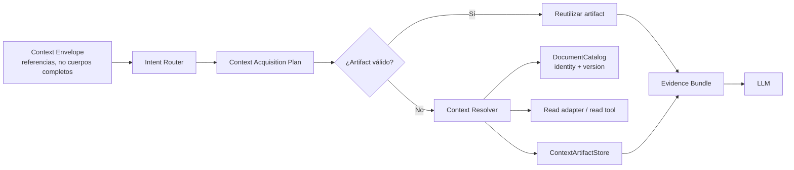

# ODESSAY — Contexto del Workspace Agent

**Contrato objetivo de invocación, ubicación y adquisición de contexto.**

## Principio central

El agente debe distinguir entre:

```text
Context Envelope
  = qué contexto está disponible

Context Acquisition Plan
  = qué contexto conviene consumir y en qué orden

Evidence Bundle
  = qué contexto se consumió realmente
```

Tener cien documentos disponibles en un Workspace no implica enviar cien documentos al LLM. La adquisición debe ser explícita para la acción y proporcional a la intención de la solicitud. La selección o adjunto autoriza los cuerpos de esos documentos; la disponibilidad del catálogo, el foco y la similitud solo sirven para explicar opciones y nunca autorizan una lectura implícita.

La adquisición bajo demanda sigue siendo útil para una pregunta sin alcance documental: permite pedir primero el alcance sin leer cuerpos. No significa enviar extractos como sustituto de los documentos seleccionados ni dejar que el modelo incorpore fuentes nuevas por su cuenta. Si una fuente adicional hace falta, la aplicación pide confirmación y reconstruye el contexto con ese nuevo alcance.

**Excepción a lazy — instrucciones de operación de `workflow.md` (ODE-504):** el archivo cumple la función de manual de operación del agente (análogo a un CLAUDE.md). Su sección de instrucciones — cómo debe operar el agente y la intención del workspace — es contexto ambiental de la invocación y no se adquiere bajo demanda: viaja siempre con su descriptor (versión/hash) para validar frescura y consume presupuesto de contexto de ODE-501 como cualquier fuente. El resto del cuerpo (contenido ejecutable de workflows) sí sigue siendo evidencia bajo demanda.

El límite entre ambas naturalezas se declara preferentemente con `<!-- workflow-definitions -->`. Para archivos legacy sin marcador, el parser es conservador: confía únicamente la línea de título H1, el preámbulo cuando existe una estructura posterior y las secciones conocidas de intención/alcance (`Intent`, `Scope`, `Objectives`, `Context`, `Participants`). El cuerpo no clasificado del título, otros bloques y un archivo completamente sin headings permanecen como evidencia bajo demanda. Si las definiciones no tienen headings, el descriptor usa un resumen acotado de su primera línea no vacía para que `scopeSummary` nunca quede vacío cuando existe contenido lazy.

## Contratos

### Agent Invocation

Es el input de una ejecución. Se reconstruye por turno.

```ts
type AgentInvocation = {
  input: UserInput
  source: "chat" | "card" | "modal" | "command"
  location: LocationContext
  runtime: RuntimeContext
  session: AgentSessionSnapshot
  preferences: UserPreferences
}
```

### Runtime Context

El runtime lo entrega el host; no se hereda del Workspace ni lo decide el LLM.

```ts
type RuntimeContext = {
  kind: "desktop" | "web" | "cloud"
  ai: "remote"
  capabilities: {
    localCatalog: boolean
    localFilesystem: boolean
    read: boolean
    write: boolean
    edit: boolean
    move: boolean
    delete: boolean
  }
}
```

### Location Context

Describe dónde está el usuario y qué tiene enfocado. No debe exponer rutas crudas a la UI ni al LLM.

```ts
type LocationContext = {
  surface: "writing" | "workspace" | "desk" | "preview"
  visibleWorkspace?: WorkspaceRef
  bindingRoot?: BindingRootRef
  focusedDocument?: DocumentRef
  selection?: TextSelection
  liveSnapshot?: LiveDocumentSnapshot
}
```

`visibleWorkspace` es una vista organizativa. `bindingRoot` es la raíz local operativa. Pueden coincidir en algunos casos, pero no son la misma entidad.

### Context Envelope

Es un snapshot inmutable de referencias y políticas. No necesita contener cuerpos completos.

```ts
type ContextEnvelope = {
  invocation: AgentInvocation
  focus: FocusContext
  availableSources: ContextSourceDescriptor[]
  policies: ContextPolicies
}
```

El envelope se puede entender en tres planos:

```text
Semantic Context
  texto, selección, referencias documentales y preferencias

Operational Context
  runtime, capabilities, DocumentCatalog y BindingRoot

Policy Context
  límites, aprobación, orden de adquisición y seguridad
```

No todo el envelope se envía al modelo. El contexto operativo sirve para resolver capacidades; el contexto semántico se filtra según el plan.

## Composición y precedencia


La prioridad semántica es:

```text
referencia explícita
  > selección o texto vivo
  > documento enfocado
  > Workspace visible
  > sesión y defaults
```

La composición no borra el contexto inferior: conserva relaciones y provenance. Una referencia explícita puede cambiar el foco sin eliminar el Workspace contenedor.

Ejemplos:

- En un Writing con Workspace asociado, el Writing es el foco y el Workspace es contexto contenedor.
- En un Workspace con un Writing seleccionado, el Writing pasa a ser el foco.
- En un Writing sin Workspace visible pero con `BindingRoot`, el documento puede seguir teniendo contexto local operativo.
- Un adjunto explícito tiene prioridad sobre el foco vivo.

El documento enfocado es información de ubicación, no una autorización adicional. `deriveAvailableSources` puede exponerlo como referencia útil, pero la aplicación debe resolver primero la selección/adjuntos confirmados y negar cualquier body de una fuente no confirmada. Si el foco está incluido explícitamente, se procesa como parte del alcance; si no, no compite por prioridad ni entra al request.

## Adquisición bajo demanda



El plan define fuentes, prioridad y presupuesto:

```ts
type ContextAcquisitionPlan = {
  intent: "conversation" | "understand" | "generate" | "tool" | "workflow"
  sources: Array<{
    ref: ContextReference
    purpose: string
    priority: number
    required: boolean
  }>
  budget: ContextBudget
  allowAdditionalRetrieval: boolean
}
```

Orden de resolución para una acción documental:

1. texto explícito de la pregunta;
2. selección o adjuntos confirmados;
3. snapshot/version/hash de esas fuentes;
4. cuerpos `.md` completos, en directo o por etapas según capacidad;
5. rangos adicionales únicamente dentro de fuentes ya confirmadas;
6. metadata del catálogo para explicar una solicitud de alcance o una ambigüedad.

Una fuente nueva mencionada en lenguaje natural no pasa automáticamente del catálogo al body: primero se muestra la posible coincidencia y se solicita confirmación.

No todos los turnos avanzan hasta el último nivel.

## Ejemplos de intención

| Solicitud | Plan esperado | Documentos consumidos |
|---|---|---:|
| `Hola` | conversación directa | 0 |
| `Explícame esta idea` con la idea en el mensaje | generación/conversación | 0 |
| `Ayúdame a redactar un párrafo` sobre la selección actual | generación con `liveSnapshot` | 0 cuerpos externos |
| `Resúmeme este documento` | confirmar el documento si no está seleccionado; después leer su `.md` completo | 1 fuente confirmada |
| `¿Qué temas se repiten en este Workspace?` | pedir alcance o usar la selección confirmada y procesarla por etapas | según capacidad física |

Para `Hola`, el agente puede saber que está en un Workspace y que corre en desktop, pero no debe inicializar ni leer documentos solo para responder.

Para `Resúmeme este documento`, la aplicación confirma el alcance si la frase no identifica de forma inequívoca una selección existente. Una vez confirmado, la fuente completa forma parte del `ContextLedger`; si no cabe en una sola llamada, se procesa por etapas lossless. No se presenta un resumen basado únicamente en metadata o extractos parciales.

## Reconstrucción e invalidación

El `ContextBuilder` debe ser stateless y reconstruible:

```ts
const envelope = contextBuilder.build({
  input,
  hostSnapshot,
  session,
})
```

Se reconstruye cuando:

- llega una nueva pregunta;
- cambia el documento, la selección o el `liveSnapshot`;
- cambia la superficie o el Workspace visible;
- cambia el runtime o sus capabilities;
- cambia el catálogo;
- el usuario agrega o retira adjuntos;
- una mutación modifica un documento;
- el modelo solicita evidencia adicional.

Reconstruir el envelope no implica volver a leer contenido. El resolver puede reutilizar artifacts válidos por versión.

Después de una mutación, cualquier artifact derivado de la versión anterior debe invalidarse o marcarse como stale.

## Boundary

El Context Builder recibe:

- input del usuario;
- snapshot de la superficie;
- runtime/capabilities del host;
- referencias de sesión y adjuntos.

Produce:

- referencias normalizadas;
- foco compuesto;
- fuentes disponibles;
- políticas y límites.

No debe:

- leer directamente filesystem, SQLite, Supabase o IndexedDB;
- decidir por sí solo qué cuerpos enviar al LLM;
- crear identidad documental para resolver un saludo;
- tratar una ruta como identidad;
- convertir un Workspace visible en un `BindingRoot` sin el contrato de catálogo.

## Estado de la adquisición y selección confirmada — ODE-489, ODE-515

`ContextEnvelope`/`AgentInvocation`/`RuntimeContext`/`LocationContext` existen como código real en `lib/agent/context-envelope.ts`, pero el envelope no concede permiso para leer cuerpos. La autorización de contexto nace en la selección o adjunto confirmado para esa acción.

El comportamiento vigente es:

1. Ask sin documentos seleccionados puede responder conversación general. Si la pregunta necesita evidencia documental, devuelve una solicitud de alcance y no envía cuerpos recientes, enfocados o adivinados.
2. Ask, Classification, Contradictions y Merge reciben el conjunto seleccionado/confirmado con snapshot, versión y hash. Las fuentes semánticas se leen completas y se incorporan al ledger.
3. Una mención de un documento fuera del alcance actual se puede desambiguar con metadata, pero requiere confirmación antes de leer o enviar su body. La confirmación inicia un nuevo fingerprint de alcance.
4. Si la selección completa no cabe en una llamada, el planner la divide en etapas o solicita dividirla. Los chunks son de transporte y no una reducción silenciosa de contenido.
5. Un turno posterior reutiliza continuidad solo si workspace, acción, selección, versión y hash siguen iguales. Una compactación o un fallo de continuidad no autoriza a sustituir la evidencia: el resolver vuelve al `.md` canónico.

Workflow, Broken links y Archive siguen siendo acciones deterministas de workspace y no necesitan el mismo bundle semántico que Contradictions, Merge o Classification. Cuando una de esas acciones presente una explicación generada, debe conservar provenance de la lectura que la originó; esa unificación de receipt es un follow-up de aplicación, no una autorización para leer documentos no seleccionados.

## Corrección de alcance y capacidad — 2026-09-13

La regla anterior de “primera evidencia” no debe interpretarse como que Contradictions o Merge envían solo extractos. Para una selección explícita, ambas acciones incorporan el markdown completo de cada documento; `ContextEnvelope`/evidence fragments son índices de provenance y recall. `workspace-document-relations.ts` y `workspace-merge.ts` parten el cuerpo en chunks ordenados únicamente para transporte y dejan la decisión de procesamiento directo o staged al planner de capacidad.

No existe un máximo de producto de cuatro o seis documentos. Contradictions puede revisar un documento contra sí mismo o varios documentos; Merge necesita al menos dos fuentes distintas. Si la carga no cabe en la ventana física, la operación pide dividir o procesa por etapas y síntesis, pero nunca analiza silenciosamente un subconjunto.

## Clasificación arquitectónica

- **Layer dominante:** `Application`.
- **Secundarios:** `Domain` para identidad/versionado; `Adapter` para resolución; `UI` para construir el snapshot de host.
- **Runtime scope:** `shared-core`, con adapters `desktop`, `web` y `cloud`.
- **Owner:** `architecture-first`.
