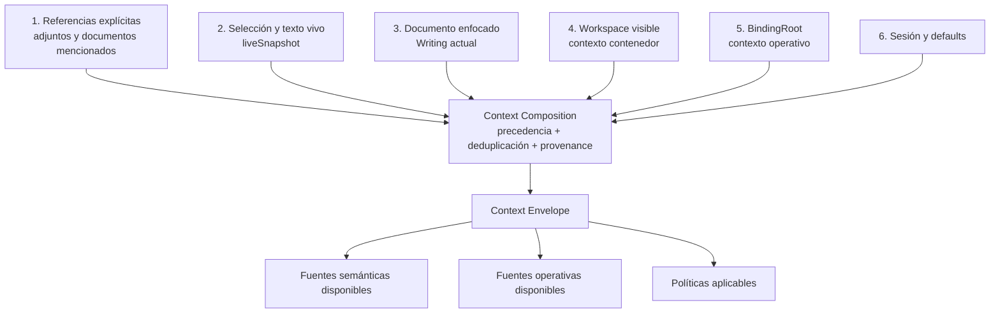
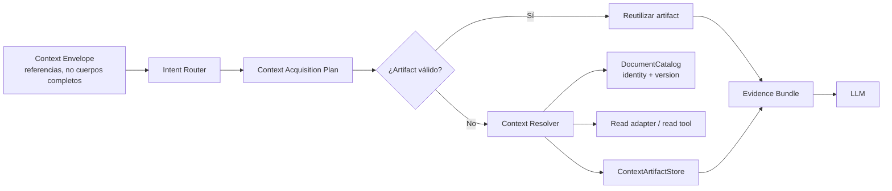

# ODESSAY — Contexto del Workspace Agent

**Contrato objetivo de invocación, ubicación y adquisición de contexto.**

## Principio central

El agente debe distinguir entre:

```text
Context Envelope
  = qué contexto está disponible

Context Acquisition Plan
  = qué contexto conviene consumir y en qué orden

Evidence Bundle
  = qué contexto se consumió realmente
```

Tener cien documentos disponibles en un Workspace no implica enviar cien documentos al LLM. La adquisición debe ser lazy y depender de la intención de la solicitud.

## Contratos

### Agent Invocation

Es el input de una ejecución. Se reconstruye por turno.

```ts
type AgentInvocation = {
  input: UserInput
  source: "chat" | "card" | "modal" | "command"
  location: LocationContext
  runtime: RuntimeContext
  session: AgentSessionSnapshot
  preferences: UserPreferences
}
```

### Runtime Context

El runtime lo entrega el host; no se hereda del Workspace ni lo decide el LLM.

```ts
type RuntimeContext = {
  kind: "desktop" | "web" | "cloud"
  ai: "remote"
  capabilities: {
    localCatalog: boolean
    localFilesystem: boolean
    read: boolean
    write: boolean
    edit: boolean
    move: boolean
    delete: boolean
  }
}
```

### Location Context

Describe dónde está el usuario y qué tiene enfocado. No debe exponer rutas crudas a la UI ni al LLM.

```ts
type LocationContext = {
  surface: "writing" | "workspace" | "desk" | "preview"
  visibleWorkspace?: WorkspaceRef
  bindingRoot?: BindingRootRef
  focusedDocument?: DocumentRef
  selection?: TextSelection
  liveSnapshot?: LiveDocumentSnapshot
}
```

`visibleWorkspace` es una vista organizativa. `bindingRoot` es la raíz local operativa. Pueden coincidir en algunos casos, pero no son la misma entidad.

### Context Envelope

Es un snapshot inmutable de referencias y políticas. No necesita contener cuerpos completos.

```ts
type ContextEnvelope = {
  invocation: AgentInvocation
  focus: FocusContext
  availableSources: ContextSourceDescriptor[]
  policies: ContextPolicies
}
```

El envelope se puede entender en tres planos:

```text
Semantic Context
  texto, selección, referencias documentales y preferencias

Operational Context
  runtime, capabilities, DocumentCatalog y BindingRoot

Policy Context
  límites, aprobación, orden de adquisición y seguridad
```

No todo el envelope se envía al modelo. El contexto operativo sirve para resolver capacidades; el contexto semántico se filtra según el plan.

## Composición y precedencia



La prioridad semántica es:

```text
referencia explícita
  > selección o texto vivo
  > documento enfocado
  > Workspace visible
  > sesión y defaults
```

La composición no borra el contexto inferior: conserva relaciones y provenance. Una referencia explícita puede cambiar el foco sin eliminar el Workspace contenedor.

Ejemplos:

- En un Writing con Workspace asociado, el Writing es el foco y el Workspace es contexto contenedor.
- En un Workspace con un Writing seleccionado, el Writing pasa a ser el foco.
- En un Writing sin Workspace visible pero con `BindingRoot`, el documento puede seguir teniendo contexto local operativo.
- Un adjunto explícito tiene prioridad sobre el foco vivo.

## Adquisición bajo demanda



El plan define fuentes, prioridad y presupuesto:

```ts
type ContextAcquisitionPlan = {
  intent: "conversation" | "understand" | "generate" | "tool" | "workflow"
  sources: Array<{
    ref: ContextReference
    purpose: string
    priority: number
    required: boolean
  }>
  budget: ContextBudget
  allowAdditionalRetrieval: boolean
}
```

Orden por defecto:

1. texto explícito de la pregunta;
2. selección actual;
3. documento enfocado;
4. metadata de documentos;
5. secciones o chunks relevantes;
6. otros documentos del Workspace;
7. recuperación adicional limitada.

No todos los turnos avanzan hasta el último nivel.

## Ejemplos de intención

| Solicitud | Plan esperado | Documentos consumidos |
|---|---|---:|
| `Hola` | conversación directa | 0 |
| `Explícame esta idea` con la idea en el mensaje | generación/conversación | 0 |
| `Ayúdame a redactar un párrafo` sobre la selección actual | generación con `liveSnapshot` | 0 cuerpos externos |
| `Resúmeme este documento` | lectura del documento enfocado o adjunto | 1, salvo ampliación |
| `¿Qué temas se repiten en este Workspace?` | lectura escalonada y comparación | según plan y presupuesto |

Para `Hola`, el agente puede saber que está en un Workspace y que corre en desktop, pero no debe inicializar ni leer documentos solo para responder.

## Reconstrucción e invalidación

El `ContextBuilder` debe ser stateless y reconstruible:

```ts
const envelope = contextBuilder.build({
  input,
  hostSnapshot,
  session,
})
```

Se reconstruye cuando:

- llega una nueva pregunta;
- cambia el documento, la selección o el `liveSnapshot`;
- cambia la superficie o el Workspace visible;
- cambia el runtime o sus capabilities;
- cambia el catálogo;
- el usuario agrega o retira adjuntos;
- una mutación modifica un documento;
- el modelo solicita evidencia adicional.

Reconstruir el envelope no implica volver a leer contenido. El resolver puede reutilizar artifacts válidos por versión.

Después de una mutación, cualquier artifact derivado de la versión anterior debe invalidarse o marcarse como stale.

## Boundary

El Context Builder recibe:

- input del usuario;
- snapshot de la superficie;
- runtime/capabilities del host;
- referencias de sesión y adjuntos.

Produce:

- referencias normalizadas;
- foco compuesto;
- fuentes disponibles;
- políticas y límites.

No debe:

- leer directamente filesystem, SQLite, Supabase o IndexedDB;
- decidir por sí solo qué cuerpos enviar al LLM;
- crear identidad documental para resolver un saludo;
- tratar una ruta como identidad;
- convertir un Workspace visible en un `BindingRoot` sin el contrato de catálogo.

## Context Gap conocido

El camino actual de Workspace selecciona documentos recientes cuando no hay adjuntos y después lee sus cuerpos completos. Ese comportamiento es bounded, pero no representa todavía el contrato lazy de este documento. La migración debe introducir primero `ContextEnvelope` y `ContextAcquisitionPlan`, sin ampliar ese fallback como arquitectura nueva.

## Clasificación arquitectónica

- **Layer dominante:** `Application`.
- **Secundarios:** `Domain` para identidad/versionado; `Adapter` para resolución; `UI` para construir el snapshot de host.
- **Runtime scope:** `shared-core`, con adapters `desktop`, `web` y `cloud`.
- **Owner:** `architecture-first`.

