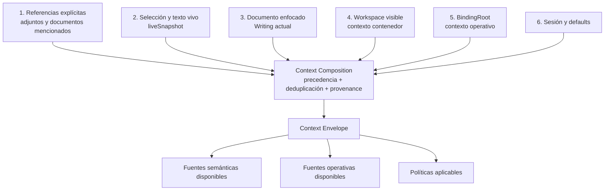
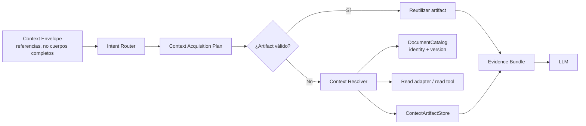

# ODESSAY — Contexto del Workspace Agent

**Contrato objetivo de invocación, ubicación y adquisición de contexto.**

## Principio central

El agente debe distinguir entre:

```text
Context Envelope
  = qué contexto está disponible

Context Acquisition Plan
  = qué contexto conviene consumir y en qué orden

Evidence Bundle
  = qué contexto se consumió realmente
```

Tener cien documentos disponibles en un Workspace no implica enviar cien documentos al LLM. La adquisición debe ser lazy y depender de la intención de la solicitud.

Ser lazy puede costar una ronda adicional al modelo en el turno puntual que sí necesita evidencia — que quien decide si hace falta esa ronda sea el propio consumidor (el modelo, viendo la pregunta) y no un clasificador previo que corra siempre, es la razón de que el costo agregado de una sesión baje: la mayoría de los turnos no necesitan evidencia y no pagan nada, en vez de que todos paguen el costo completo por si acaso.

## Contratos

### Agent Invocation

Es el input de una ejecución. Se reconstruye por turno.

```ts
type AgentInvocation = {
  input: UserInput
  source: "chat" | "card" | "modal" | "command"
  location: LocationContext
  runtime: RuntimeContext
  session: AgentSessionSnapshot
  preferences: UserPreferences
}
```

### Runtime Context

El runtime lo entrega el host; no se hereda del Workspace ni lo decide el LLM.

```ts
type RuntimeContext = {
  kind: "desktop" | "web" | "cloud"
  ai: "remote"
  capabilities: {
    localCatalog: boolean
    localFilesystem: boolean
    read: boolean
    write: boolean
    edit: boolean
    move: boolean
    delete: boolean
  }
}
```

### Location Context

Describe dónde está el usuario y qué tiene enfocado. No debe exponer rutas crudas a la UI ni al LLM.

```ts
type LocationContext = {
  surface: "writing" | "workspace" | "desk" | "preview"
  visibleWorkspace?: WorkspaceRef
  bindingRoot?: BindingRootRef
  focusedDocument?: DocumentRef
  selection?: TextSelection
  liveSnapshot?: LiveDocumentSnapshot
}
```

`visibleWorkspace` es una vista organizativa. `bindingRoot` es la raíz local operativa. Pueden coincidir en algunos casos, pero no son la misma entidad.

### Context Envelope

Es un snapshot inmutable de referencias y políticas. No necesita contener cuerpos completos.

```ts
type ContextEnvelope = {
  invocation: AgentInvocation
  focus: FocusContext
  availableSources: ContextSourceDescriptor[]
  policies: ContextPolicies
}
```

El envelope se puede entender en tres planos:

```text
Semantic Context
  texto, selección, referencias documentales y preferencias

Operational Context
  runtime, capabilities, DocumentCatalog y BindingRoot

Policy Context
  límites, aprobación, orden de adquisición y seguridad
```

No todo el envelope se envía al modelo. El contexto operativo sirve para resolver capacidades; el contexto semántico se filtra según el plan.

## Composición y precedencia



La prioridad semántica es:

```text
referencia explícita
  > selección o texto vivo
  > documento enfocado
  > Workspace visible
  > sesión y defaults
```

La composición no borra el contexto inferior: conserva relaciones y provenance. Una referencia explícita puede cambiar el foco sin eliminar el Workspace contenedor.

Ejemplos:

- En un Writing con Workspace asociado, el Writing es el foco y el Workspace es contexto contenedor.
- En un Workspace con un Writing seleccionado, el Writing pasa a ser el foco.
- En un Writing sin Workspace visible pero con `BindingRoot`, el documento puede seguir teniendo contexto local operativo.
- Un adjunto explícito tiene prioridad sobre el foco vivo.

**Contradicción conocida entre este orden y el código actual:** `deriveAvailableSources` (`lib/agent/context-envelope.ts`) sigue listando el documento enfocado *antes* que los adjuntos explícitos — el orden inverso al declarado arriba. Para `ask` esto dejó de importar en la práctica: el documento enfocado no compite por ese orden porque se excluye por completo de la lectura inmediata (ver "Estado de la adquisición lazy" abajo). Para Classify, donde el documento enfocado sí se lee de inmediato junto con los adjuntos, el orden real sigue siendo el incorrecto — no se corrigió deliberadamente, para no cambiar comportamiento de producción sin poder probarlo en un entorno con IA en vivo. Sigue siendo una discrepancia real entre este documento y el código para ese caso.

## Adquisición bajo demanda



El plan define fuentes, prioridad y presupuesto:

```ts
type ContextAcquisitionPlan = {
  intent: "conversation" | "understand" | "generate" | "tool" | "workflow"
  sources: Array<{
    ref: ContextReference
    purpose: string
    priority: number
    required: boolean
  }>
  budget: ContextBudget
  allowAdditionalRetrieval: boolean
}
```

Orden por defecto:

1. texto explícito de la pregunta;
2. selección actual;
3. documento enfocado;
4. metadata de documentos;
5. secciones o chunks relevantes;
6. otros documentos del Workspace;
7. recuperación adicional limitada.

No todos los turnos avanzan hasta el último nivel.

## Ejemplos de intención

| Solicitud | Plan esperado | Documentos consumidos |
|---|---|---:|
| `Hola` | conversación directa | 0 |
| `Explícame esta idea` con la idea en el mensaje | generación/conversación | 0 |
| `Ayúdame a redactar un párrafo` sobre la selección actual | generación con `liveSnapshot` | 0 cuerpos externos |
| `Resúmeme este documento` | lectura del documento enfocado o adjunto | 1, salvo ampliación |
| `¿Qué temas se repiten en este Workspace?` | lectura escalonada y comparación | según plan y presupuesto |

Para `Hola`, el agente puede saber que está en un Workspace y que corre en desktop, pero no debe inicializar ni leer documentos solo para responder.

Para `Resúmeme este documento`, la fila dice "1" documento consumido — eso describe el resultado final, no la mecánica: cuando el documento en cuestión es el enfocado (no un adjunto explícito), la implementación actual hace 1 llamada de referencia sin cuerpo y, si el modelo lo pide de vuelta, 1 llamada adicional con el cuerpo — 2 llamadas al modelo por 1 documento consumido, nunca más. Ver "Estado de la adquisición lazy" arriba.

## Reconstrucción e invalidación

El `ContextBuilder` debe ser stateless y reconstruible:

```ts
const envelope = contextBuilder.build({
  input,
  hostSnapshot,
  session,
})
```

Se reconstruye cuando:

- llega una nueva pregunta;
- cambia el documento, la selección o el `liveSnapshot`;
- cambia la superficie o el Workspace visible;
- cambia el runtime o sus capabilities;
- cambia el catálogo;
- el usuario agrega o retira adjuntos;
- una mutación modifica un documento;
- el modelo solicita evidencia adicional.

Reconstruir el envelope no implica volver a leer contenido. El resolver puede reutilizar artifacts válidos por versión.

Después de una mutación, cualquier artifact derivado de la versión anterior debe invalidarse o marcarse como stale.

## Boundary

El Context Builder recibe:

- input del usuario;
- snapshot de la superficie;
- runtime/capabilities del host;
- referencias de sesión y adjuntos.

Produce:

- referencias normalizadas;
- foco compuesto;
- fuentes disponibles;
- políticas y límites.

No debe:

- leer directamente filesystem, SQLite, Supabase o IndexedDB;
- decidir por sí solo qué cuerpos enviar al LLM;
- crear identidad documental para resolver un saludo;
- tratar una ruta como identidad;
- convertir un Workspace visible en un `BindingRoot` sin el contrato de catálogo.

## Estado de la adquisición lazy (ODE-489, resuelto parcialmente)

`ContextEnvelope`/`AgentInvocation`/`RuntimeContext`/`LocationContext` ya existen como código real, no solo como este documento: `lib/agent/context-envelope.ts`. El documento enfocado (`LocationContext.focusedDocument`) ya sigue el contrato lazy — implementado, no solo diseñado.

Mecanismo implementado — más simple que el pipeline Router → Planner → Resolver dibujado arriba; no hay una etapa de clasificación de intención separada:

1. El documento enfocado se manda como referencia (`focusedDocumentId`, metadata con `markdown: null`) en la primera llamada a `askWorkspace`, nunca su cuerpo.
2. El propio modelo, dentro de esa misma llamada, decide si necesita el contenido y lo pide de vuelta mediante el campo ya existente `requestedDocumentIds`.
3. Si lo pide, corre como máximo **una** ronda adicional con el cuerpo incluido — nunca más de una, y nunca para un id que no sea el documento enfocado (pedir cualquier otro id sigue el camino manual existente: se lo indica al usuario, no se auto-ejecuta).
4. Si esa segunda ronda falla (error de red, del provider, lo que sea), se conserva la respuesta de la primera ronda en vez de fallar el turno completo. El chat nunca debe quedar en silencio — ni por el mecanismo lazy ni por ningún otro motivo.

Con esto, un `Hola` con cualquier Writing abierto ya no lee ni envía ningún cuerpo documental — antes sí lo hacía siempre, sin importar la intención de la pregunta. Cubre ambos runtimes: `askAgent` (con Workspace) y `askAboutDocument` (sin Workspace, borrador sin materializar).

**Por qué una ronda adicional ocasional es más barato, no más caro:** antes, el 100% de los turnos de `ask` pagaban el costo completo del documento enfocado, en cada mensaje, sin importar la intención. Ahora, un turno puramente conversacional paga prácticamente cero, y solo el turno que de verdad necesita el documento paga la ronda extra. El costo agregado de una sesión baja, aunque un turno individual — el que sí necesita el documento — cueste dos llamadas en vez de una.

Gaps que siguen abiertos, sin resolver:

- No hay un Intent Router formal que clasifique la intención *antes* de la llamada al modelo — la decisión "necesito el documento" la toma el modelo dentro de la misma llamada de ask, reactivamente, no un paso previo separado y determinista.
- Los adjuntos explícitos y la selección auto-elegida de Workspace (Classify) no pasan por este contrato lazy — se leen de inmediato, sin diferir, igual que antes. El contrato lazy solo cubre el documento enfocado implícito, no el resto de fuentes.
- El resto del catálogo del Workspace (documentos que no son ni el enfocado ni un adjunto) sigue sin exponerse en absoluto durante una pregunta de chat libre, ni siquiera como referencia — solo Classify ve una porción amplia del catálogo.
- De los cinco workflows predeterminados, solo dos seleccionan documentos específicos: en el estado actual Contradictions y Merge construyen y consumen `ContextEnvelope` (`policies.eagerlyLoadFocusedDocument: true`), por lo que comparar o combinar todavía carga de inmediato el material seleccionado. ODE-515 cambia el contrato objetivo: esa primera evidencia debe poder volver a Responses y el modelo puede pedir fragmentos adicionales acotados antes de emitir un veredicto. Workflow, Broken links y Archive no tienen selección de documentos que envolver — operan sobre todo el Workspace vía el servicio directamente (`service.proposeWorkflow`/`findBrokenReferences`/`findArchiveCandidates`), así que `ContextEnvelope` no aplica de la misma forma; envolverlos solo para etiquetar `source`/sesión sería un cambio cosmético sin efecto funcional, y no se hizo.

## Clasificación arquitectónica

- **Layer dominante:** `Application`.
- **Secundarios:** `Domain` para identidad/versionado; `Adapter` para resolución; `UI` para construir el snapshot de host.
- **Runtime scope:** `shared-core`, con adapters `desktop`, `web` y `cloud`.
- **Owner:** `architecture-first`.
