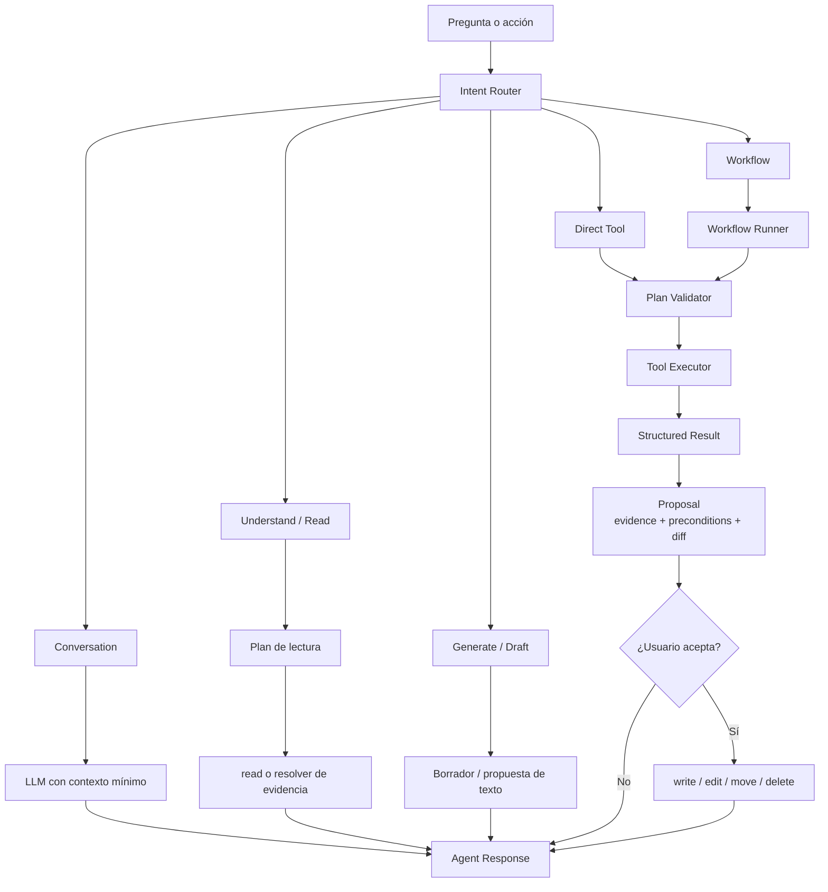
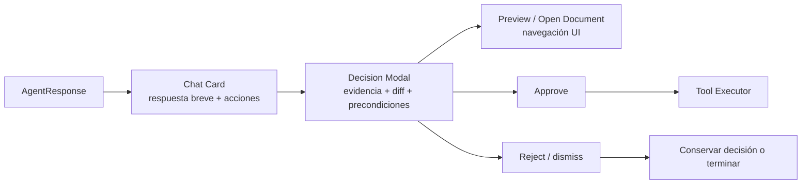

# ODESSAY — Ejecución, Tools y Workflows del Workspace Agent

**Contrato objetivo de routing, ejecución y presentación de acciones.**

## No todo es una tool

Una tool es una capacidad ejecutable. Una consulta libre puede resolverse con el LLM y el contexto ya disponible, sin tool ni workflow.

```ts
type AgentIntent =
  | { kind: "conversation" }
  | { kind: "understand" }
  | { kind: "generate" }
  | { kind: "tool"; tool: ToolName }
  | { kind: "workflow"; workflow: WorkflowName }
```

## Caminos de ejecución



## Registry

El agente necesita un registry explícito. El LLM no debe inventar nombres, schemas ni capacidades.

```ts
type AgentCapabilityDescriptor = {
  name: string
  kind: "tool" | "workflow"
  inputSchema: unknown
  outputSchema: unknown
  runtimes: RuntimeKind[]
  requiresApproval: boolean
  mutates: boolean
  requiredCapabilities: string[]
}
```

### Tools atómicas

Las tools actuales del Workspace Agent son:

| Tool | Naturaleza | Aprobación |
|---|---|---|
| `read` | leer evidencia documental | puede tener aprobación de lectura según flujo |
| `write` | crear o reemplazar un documento | sí |
| `edit` | modificar un documento existente | sí |
| `move` | cambiar ubicación/binding permitido | sí |
| `delete` | eliminar o proponer eliminación | sí |

Todas deben resolver primero `DocumentRef → DocumentCatalog → adapter concreto`. Ninguna recibe un UUID y lo interpreta como una ruta.

### Workflows

Los workflows son secuencias declarativas o controladas de tools. Ejemplos:

- `classify`: leer documentos, construir propuestas de tipo/estatus y presentarlas;
- `broken-links`: leer referencias, detectar enlaces rotos y proponer reemplazos;
- `archive-candidates`: calcular candidatos y pedir confirmación;
- `contradictions`: buscar evidencia contradictoria y mostrarla;
- `draft-workflow`: sintetizar una propuesta de `workflow.md` sin escribirla automáticamente.

Un workflow puede fallar, pedir más evidencia o producir cero propuestas. No debe asumir que porque fue invocado tiene permiso de mutar.

## Validación y seguridad

El `PlanValidator` verifica:

- que el tool/workflow exista en el registry;
- que el input cumpla el schema;
- que el runtime soporte la capacidad;
- que las referencias sean resolubles;
- que las precondiciones sigan vigentes;
- que el presupuesto no se haya agotado;
- que la acción tenga el gate de aprobación correcto;
- que la mutación respete el write-path documental.

El LLM puede elegir un camino semántico. No puede saltarse esta validación.

## Proposal y mutación

Las operaciones de cambio siguen este ciclo:

```text
plan
  → evidencia
  → propuesta
  → diff/precondiciones
  → aprobación explícita
  → tool de mutación
  → receipt
  → refresh del catálogo
```

El agente nunca debe escribir directamente al `.md`. La tool delega al `DocumentService` y al adapter correspondiente. En desktop se conserva el orden:

```text
.md atómico
  → manifest atómico
  → SQLite + enqueue
  → sync cloud en background
```

## Agent Response

La ejecución produce un contrato común para chat y detalle:

```ts
type AgentResponse = {
  answer: string
  evidence: EvidenceItem[]
  actions: ActionProposal[]
  status: "complete" | "needs_approval" | "needs_context" | "insufficient_evidence" | "budget_exceeded" | "cancelled" | "unable"
  coverage: "complete" | "partial" | "unknown"
  contextUsed: ContextReference[]
  receipts?: MutationReceipt[]
}
```

La Card muestra un resumen accionable. El Modal muestra toda la información necesaria para tomar la decisión.



Abrir un documento citado no es una tool: es una acción de navegación de la interfaz. La UI puede usar el `DocumentRef` de la evidencia para resolver `OpenDocument(UUID)`.

## Ciclo semántico con Responses

Las tools deterministas aportan observaciones, diffs y precondiciones con procedencia. No deben decidir por sí mismas que existe una contradicción ni que una versión gana. Para las operaciones que requieren comprensión del significado, el adapter de OpenAI Responses ejecuta un ciclo acotado:

```text
intención + descriptor + evidencia inicial
  → Responses
  → function_call (read/evidence acotada)
  → validación de capability, identidad, versión y presupuesto
  → ejecución por DocumentCatalog/adapter
  → function_call_output con call_id
  → Responses: veredicto estructurado o nueva solicitud de evidencia
```

El ciclo termina con un resultado `complete`, `insufficient_evidence`, `budget_exceeded` o `cancelled`. La cobertura (`complete | partial | unknown`) forma parte del resultado; una cobertura parcial nunca se presenta como “sin conflictos”. Las tools de `write`, `edit`, `move` y `delete` no se exponen como escrituras implícitas del modelo: solo reciben una propuesta validada y la aprobación existente.

ODE-515 implementa este contrato para Contradictions y Merge. ODE-509 define el veredicto semántico, ODE-510/511 sus consumidores y ODE-512 las pruebas. ODE-513 conserva los Response IDs, Items y `call_id` en los logs de OpenAI; no convierte el chat efímero en historial local.

## Consultas libres

| Usuario | Ruta |
|---|---|
| `Hola` | `conversation`, sin lectura documental |
| `Explícame esta idea` | `conversation` o `understand` según haya referencias |
| `Ayúdame a redactar un párrafo` | `generate`, devuelve borrador |
| `Inserta este párrafo` | `generate` + proposal + `edit` tras aprobación |
| `Resúmeme este documento` | `understand`, lectura targeted |
| `Corrige este enlace` | workflow `broken-links` |

## Boundaries

El router y el orquestador viven en `Application`. El registry contiene contratos compartidos. Las implementaciones concretas de `read`, `write`, `edit`, `move` y `delete` viven en adapters o servicios autorizados por runtime.

La UI no puede convertir un botón en una escritura directa. El botón confirma una propuesta; el executor ejecuta la tool.

## Estado actual frente al objetivo

No existe todavía un `AgentIntent` formal ni una etapa de Router separada de la llamada al modelo — nada clasifica `conversation` / `understand` / `generate` / `tool` / `workflow` como un paso previo y determinista. Lo que sí existe, como código real y probado, es una versión más acotada de los kinds `tool`/`workflow`:

`askWorkspace` — la misma llamada conversacional que responde el chat, no una llamada de router separada — devuelve un campo `suggestedAction: "workflow" | "broken-links" | "classification" | "archive" | "contradictions" | null`. El modelo lo fija solo cuando el usuario pide explícitamente ejecutar una de esas cinco acciones predeterminadas, nunca cuando solo las discute o pregunta cómo funcionan (instrucción explícita del prompt). El panel (`workspace-agent-panel.tsx`, `dispatchSuggestedAction`) despacha a la misma función que usan los botones (`runWorkflow`, `runBrokenReferences`, `executeClassification`, etc.) — el mismo camino aprobado de la sección "Proposal y mutación" arriba, no un atajo nuevo.

Esto cubre parcialmente los kinds `tool`/`workflow` — solo para las cinco acciones predeterminadas de este catálogo, no composición libre de tools nuevas. `merge` queda fuera de `suggestedAction` (mock de UI sin tool de backend, ver `odessay-agent-context.md`). Los kinds `conversation`/`understand`/`generate` de la tabla "Consultas libres" no se distinguen con una etiqueta explícita en ningún punto del código: `askAgent`/`askAboutDocument` los atienden de forma uniforme a través del mismo mecanismo lazy (`odessay-agent-context.md`, "Estado de la adquisición lazy"), sin una clasificación previa que los nombre — la tabla de arriba describe el resultado esperado, no un router que literalmente produzca esas tres etiquetas.

Sigue sin existir: un `Registry` de `AgentCapabilityDescriptor` consultable (la validación de cada tool/workflow vive dispersa en su propio código, no en un registry central); un `PlanValidator` formal único; un `AgentResponse` compartido que alimente tanto Chat Card como Decision Modal.

También falta el ciclo semántico de múltiples rondas: hoy `suggestedAction` puede despachar una acción predeterminada, pero las herramientas de Contradictions y Merge todavía no devuelven observaciones a Responses para que el modelo pida contexto adicional y reevalúe. Esa diferencia es el Context Gap que ODE-515 debe cerrar.

## Clasificación arquitectónica

- **Layer dominante:** `Application`.
- **Secundarios:** `Domain` para precondiciones; `Adapter` para ejecución; `UI` para Card/Modal.
- **Runtime scope:** `shared-core` + adapters `desktop`, `web` y `cloud`.
- **Owner:** `architecture-first`.
